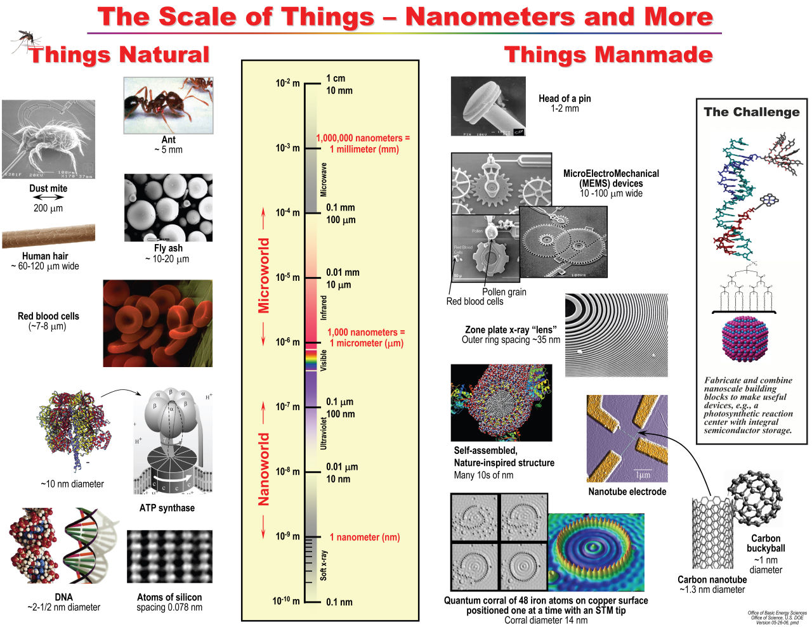
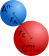
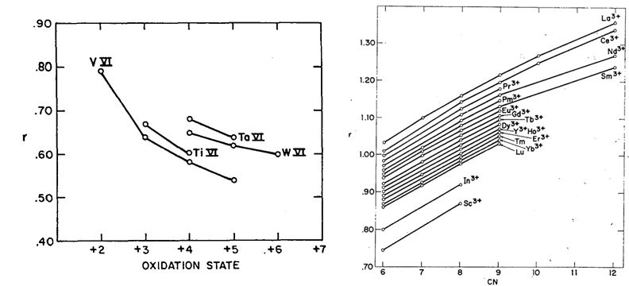
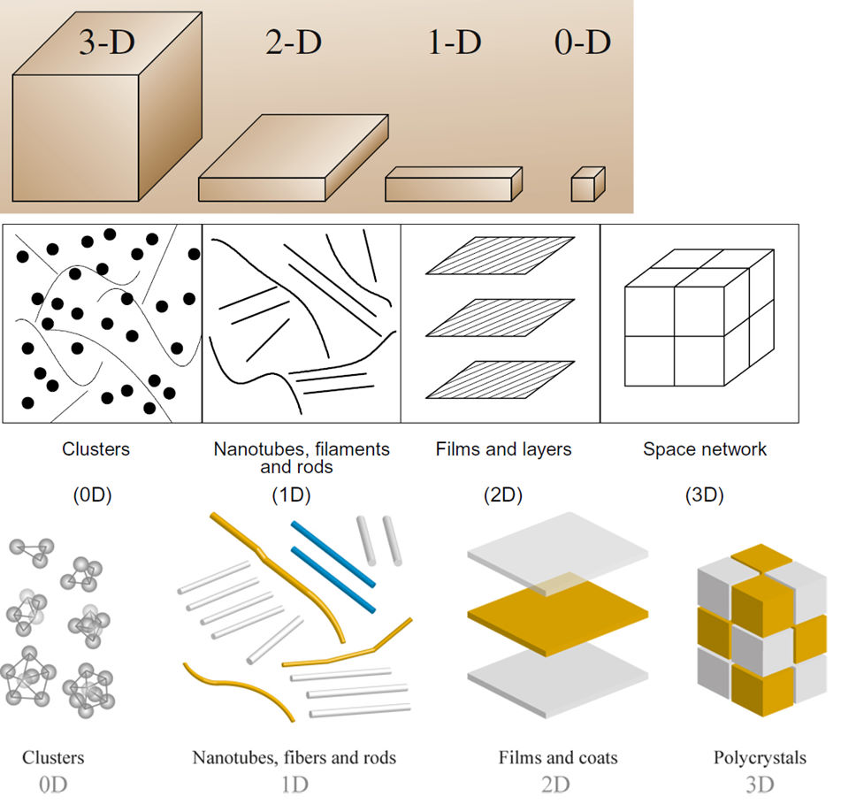
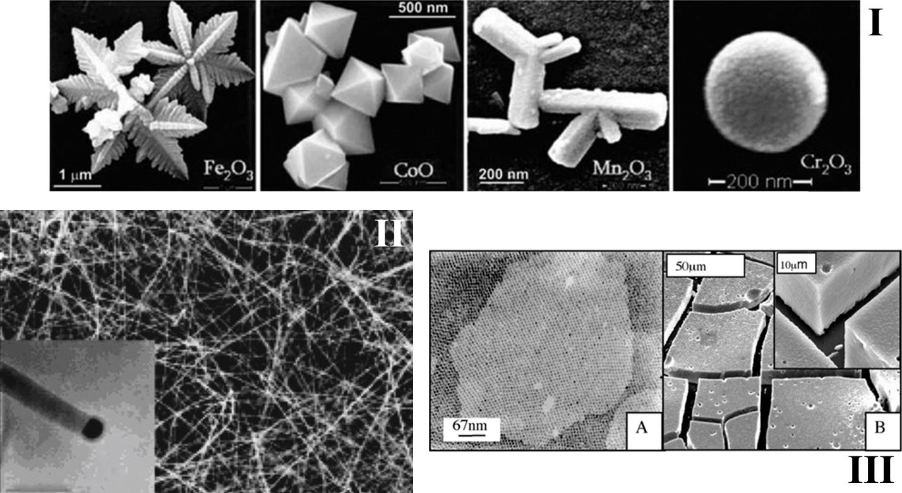
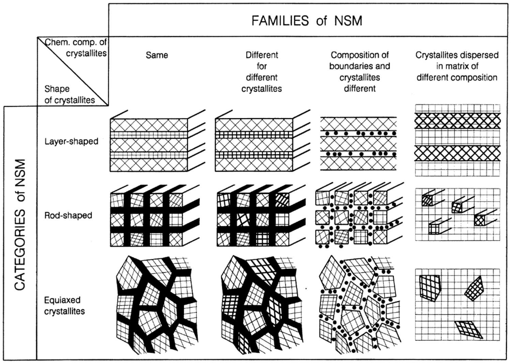
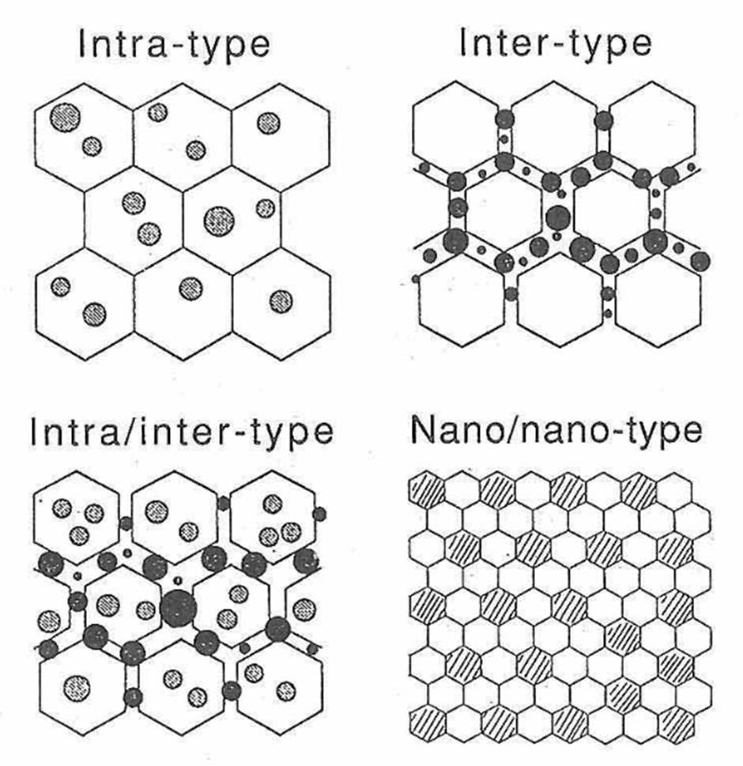

# Introduction

It seems as if every course out there has to have its small, least useful, least informative, obligatory introductory lecture, whose singular role is to set the scene for the rest of the course. This is one of those lectures.

## Definitions

So, let's start with some basic definitions. As chemists, when it comes to the definitions, we have IUPAC to consult with. This organization, among other things, provides us with the dictionaries of chemical and related terms, such as the goldbook.[^1] Well, in this case, the goldbook defines only the *nano* prefix and what a *nanocomposite* is.

> **nano**: SI prefix for $10^{−9}$ (symbol: n)

> **nanocomposite**: composite in which at least one of the phase domains has at least one dimension of the order of nanometers

ISO, in turn, in its "explanation of selected terms from the nanotechnologies" note[^2] gives the definitions of *nanoscale* and *nanomaterial*.

> **nanoscale**: length range approximately from 1 nm to 100 nm

> **nanomaterial**: material with any external dimension in the nanoscale (nano-object, e.g. nanoparticle, nanofibre, nanoplate, nanofilm, nanolayer) or having an internal structure or surface structure in the nanoscale (nanostructured material, or NsM)

We see that to classify a material as a nanomaterial, at least something in it, along some dimension, should be nanoscale, i.e., from 1 to 100 nm. Pay attention to the word "dimension" here, because we'll return to it later.

Another important point regarding the nanomaterials is aptly illustrated in the following quote, ascribed to Koelling from Argonne National Laboratory (USA):

> The nanoscale is not just another step towards miniaturization. It is a qualitatively new scale where materials properties differ significantly from the same properties in the bulk.

This quote answers the question of why people are so obsessed with everything "nano". Thus, the main goal of preparing something in the nanostate should consist in obtaining the properties that are distinctly different from those of the bulk material of the same composition.

<figure markdown>
  
  <figcaption markdown>The Scale of Things. Source - [U.S. Department of Energy](https://science.osti.gov/bes/Community-Resources/Scale-of-Things-Chart).</figcaption>
</figure>

But how small is 10 to the -9 meters? Please look at the scale of things above. We see that even the red blood cells are not truly nanoscale, as well as almost all bacteria and appropriately named microbes, which are at least several micrometers "tall". Meanwhile, bulky proteins such as this ferment or DNA moleculre and some viruses such as COVID-19 are natural nanomaterials.

Among the manmade small things, on the micrometer scale are the MEMS devices, some of the most commonly known of which can be found in your cellphones (these are MEMS accelerometers, gyroscopes and maybe optical image stabilizers). Likewise, some of the very old integrated circuits such as the famous Intel 8080 microprocessor were characterized by the micrometer sized technology node. This means that, for example, in the Intel 8080 the minimum size and spacing for features on each layer of the chip were 6 μm. As we know, the state-of-the-art process nodes for the modern CPUs are of the order of several nm. In the world of materials science, some of the most well-known nanomaterials are carbon based: these are the buckyballs, nanotubes, graphene layers, etc. And, of course, atoms and ions are at the lowest end of the scale of things.

## Ionic radii

Since nanomaterials are solids, and most solids are ionic, I'd like to digress a little and discuss a concept that is very useful for materials scientists, that is, the concept of ionic radii. First of all, we all know that ions are not rigid spheres and, strictly speaking, they have no radius as such. However, it helps our imagination when we think of them as of spheres. Besides, it turns out that if we ascribe some formal radii to the ions, the resulting oversimplified model may help to predict the trends in the size of the crystal lattices and even some dependent properties of materials.

<figure markdown>
  
  <figcaption>An "incorrect", albeit very useful, rigid-sphere representation of ions (anion A and cation C) and their sizes</figcaption>
</figure>

Where do we get the formal values to give to the radii? From the interatomic distances, which can be easily obtained from the structural (e.g., X-ray diffraction) data. And then we have a problem: which fraction of the interatomic distance do we give to the cation, and which - to the anion? This problem doesn't have a straightforward solution. Robert Shannon, the creator of the most widely used compilation of ionic radii,[^3] actually defines two frames of reference: the so-called crystal and ionic radii. He says that "crystal" radii should be closer to the actual sizes of the ions in solids while the "ionic" is presented for more compatibility with the previous works. Still, surprisingly, ionic system is more widely used. While you may encounter one or the other, the important thing is not to mix them up. The systems differ by 0.14 Å: the ionic radii of the anions are larger, and those of the cations - smaller than the respective crystal radii. For instance, the crystal radius of VI-coordinated $\ce{O^{2-}}$ is 1.26 Å, and the ionic radius is 1.40 Å.

In the following quote of Shannon you see the factors influencing the size that we ascribe to the ions.

> Additivity of both cation and anion radii to reproduce interatomic distances is valid if one considers coordination number (CN), electronic spin, covalency, repulsive forces, and polyhedral distortion.[^3]

There is quite a number of those factors. Some of them, such as CN and oxidation state, are taken into account in the Shannon tables. Take a look, for example, at the following two plots with the trends with which you are likely familiar from your previous general chemistry studies.

<figure markdown>
  
  <figcaption markdown>Radii of some cations vs their oxidation state (left) and coordination number (right)[^3]</figcaption>
</figure>

There are even some works expanding the Shannon tables with the additional data that can be used within the same framework are presented.[^4] Some of the factors, not mentioned by Shannon are, however, rather hard to estimate. For example, the temperature dependence of the ionic size. Trying to accomodate them within the model leads to creation of different radii systems, such as the one by Miller and Tidrow.[^5] However, Shannon tables[^3] still remain the most comprehensive and widely used data set regarding the ionic sizes.

## Classifications of nanomaterials

> Shape is such an important property that classification of nanomaterials can be based on their dimensionality or aspect ratio.[^6]

We should now "scale up" our discussion and from the world of atoms and ions transcend to the world of nanomaterials that they make up. As the quote says, shape is very important, and among nanomaterials one can find all kinds of shapes. Below are some schematic representations of those.

<figure markdown>
  {width="600"}
  <figcaption markdown>Dimensions of nanomaterials [^6] [^7] [^8]</figcaption>
</figure>

The real-life examples of 0-D objects are quantum dots, nanoparticles, and fullerenes. The most famous 1-D materials are the single-walled nanotubes and multi-walled carbon nanotubes. Two-dimensional materials include graphene, boron nitride (h-BN), and graphene oxide, as well as multitudinous other films and coatings. Typical 3-D nanostructured materials are nanoporous metals and ceramics, aerogels, and zeolites.

<figure markdown>
  {width="600"}
  <figcaption markdown>Scanning electron microscopy images of 0D metal oxide nanoparticles (I),[^9] 1D GaAs nanowires with a single nanowire in the inset (II),[^8] and 2D and 3D silver nanocrystals (III).[^10]</figcaption>
</figure>

We can also categorize the nanostructured materials, or NsMs, by their dimensionality. Nanostructured materials are those with nanometer-sized microstructures.
According to the shape of the crystallites, three categories of NsM may be distinguished: layer-shaped crystallites, rod-shaped crystallites (with layer thickness or rod diameters of the order of a few nanometers), and NsM composed of equiaxed nanometer-sized crystallites.

<figure markdown>
  
  <figcaption markdown>Nanostructured materials[^11]</figcaption>
</figure>

Depending on the chemical composition of the crystallites, three categories of NsM may be grouped into four families. In the most simple case, all crystallites and interfacial regions have the same chemical composition. Examples of this family of NsM are semicrystalline polymers (consisting of stacked crystalline lamellae separated by non-crystalline regions). Quantum well (multilayer) structures are probably the most well-known examples of the second family, where the crystallites possess different chemical compositions. If the compositional variation occurs primarily between crystallites and the interfacial regions, the third family of NsM is obtained. This happens, for example, when the components of the main phase segregate preferentially at the grain boundaries. The fourth family of NsM is formed by nanometer-sized crystallites (layers, rods or equiaxed crystallites) dispersed in a matrix of different chemical composition. Precipitation-hardened alloys belong in this group of NsM. For example, nanometer-sized Ni3Al precipitates dispersed in a Ni matrix are generated by annealing a supersaturated Ni-Al solid solution are an example of such alloys. Most high-temperature materials used in jet engines of modern aircraft are based on precipitation-hardened Ni3Al/Ni alloys.

<figure markdown>
  {width="400"}
  <figcaption markdown>Nanocomposites[^12]</figcaption>
</figure>

This is a different classification system that was proposed for ceramic nanocomposites. As schematically drawn in this figure, in the intra- and intergranular nanocomposites, the nanosized particles are dispersed mainly within the matrix grains or at the grain boundaries of the matrix, respectively. Such materials possess improved mechanical properties such as hardness, fracture strength and toughnessat room temperature and high temperatures. On the other hand, the nano/nano composites are made of the dispersoids and matrix grains with the nanometer-size. The primary purpose of these composites is to add new functions, such as machinability and superplasticity, to ceramics.

## Classifications of synthesis methods

Now we know what differentiates materials and nanomaterials, and we're interested (I hope) in the techniques for their preparation. Although the classification of different synthesis methods was also covered in the introductory lecture, here it is posted as a [separate page](./synthesis/classification.md) for the ease of reference.

[^1]: IUPAC Gold Book, [goldbook.iupac.org](https://goldbook.iupac.org)
[^2]: Nanotechnologies — Plain language explanation of selected terms from the ISO/IEC 80004 series, [ISO/TR 18401:2017(en)](https://www.iso.org/obp/ui/#iso:std:iso:tr:18401:ed-1:v1:en)
[^3]:
    Shannon R. Revised effective ionic radii and systematic studies of interatomic distances in halides and chalcogenides. Acta Crystallographica Section A. 1976;32(5):751-67. [https://doi.org/10.1107/S0567739476001551](https://doi.org/10.1107/S0567739476001551)

    See also the Database of Ionic Radii, which is a compilation of the Shannon radii hosted by Imperial College London, [http://abulafia.mt.ic.ac.uk/shannon/ptable.php](http://abulafia.mt.ic.ac.uk/shannon/ptable.php)
[^4]: Jia YQ. Crystal radii and effective ionic radii of the rare earth ions. Journal of Solid State Chemistry. 1991;95(1):184-7. [https://doi.org/10.1016/0022-4596(91)90388-X](https://doi.org/10.1016/0022-4596(91)90388-X)
[^5]: Miller VL, Tidrow SC. Perovskites: Temperature and Coordination Dependent Ionic Radii. Integrated Ferroelectrics. 2013;148(1):1-16. [https://doi.org/10.1080/10584587.2013.851576](https://doi.org/10.1080/10584587.2013.851576)
[^6]: Vajtai R. Springer Handbook of Nanomaterials. Springer, 2013. eISBN 978-3-642-20595-8. [https://doi.org/10.1007/978-3-642-20595-8](https://doi.org/10.1007/978-3-642-20595-8)
[^7]: Gusev A.I., Rempel A.A. Nanocrystalline Materials. Cambridge International Science Publishing, 2004. ISBN 1898326266.
[^8]: Glossary of nanotechnology and related terms, [https://eng.thesaurus.rusnano.com/wiki/article1371](https://eng.thesaurus.rusnano.com/wiki/article1371)
[^9]: A.R. West. Solid State Chemistry and its Applications, Second Edition, Student Edition. Wiley, 2014. ISBN 978-1-119-94294-8. 
[^10]: C. Brechignac, P. Houdy, M. Lahmani. Nanomaterials and Nanochemistry. Springer, 2007. eISBN 978-3-540-72993-8. [https://doi.org/10.1007/978-3-540-72993-8](https://doi.org/10.1007/978-3-540-72993-8)
[^11]: Gleiter H. Nanostructured materials: basic concepts and microstructure. Acta Materialia, 2000, 48(1), 1–29. [https://doi.org/10.1016/s1359-6454(99)00285-2](https://doi.org/10.1016/s1359-6454(99)00285-2)
[^12]: Niihara K. New Design Concept of Structural Ceramic. Journal of The Ceramic Society of Japan, 1991, 99(10), 974-982. [https://doi.org/10.2109/jcersj.99.974](https://doi.org/10.2109/jcersj.99.974)