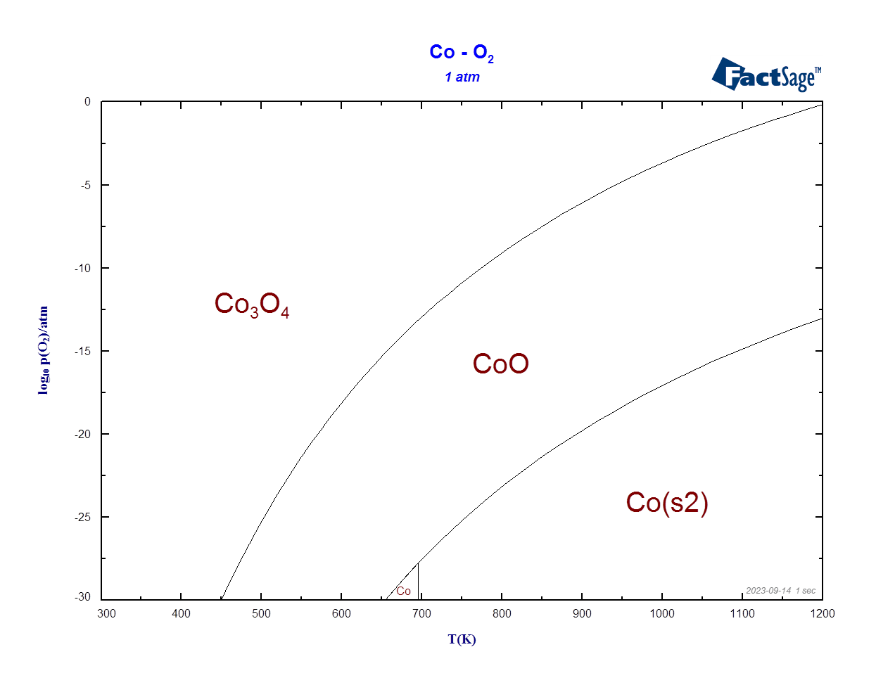
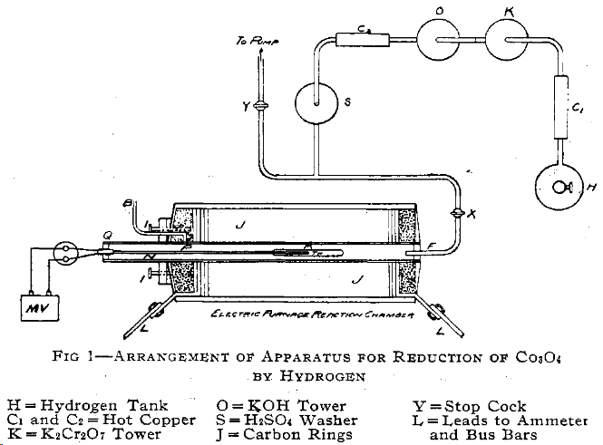
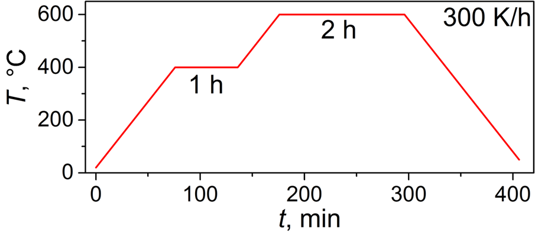

## Literature

In this lab we prepare metallic cobalt by reducing the cobalt-containing precursors in hydrogen flow. Since we're not the first to come up with this idea, let's check out the reference literature.

> Cobalt oxalate, precipitated in the cold, is dried at 120 °C and ground to a fine powder. It is then reduced with $\ce{H2}$ (six hours at 500 °C), with the temperature being raised rapidly at the beginning of the run. The product is cooled, ground and reduced once more; the fine metal powder is stored in a glass vessel under alcohol.[^1]

This is way too complex for our purposes for at least two reasons. First, it's necessary to prepare cobalt oxalate and reduce it twice, which makes it a three-step synthesis. Second, we can expect that very thin and highly reactive cobalt powder would result from the oxalate decomposition. For us, coarse powder less prone to being oxidized by ambient air would be more convenient.

> The reduction of $\ce{Co3O4}$ to metallic cobalt by hydrogen gas takes place very rapidly at all temperatures above 500 °C. … For the production of cobalt from $\ce{Co3O4}$ by hydrogen, the charge must be completely cooled in an atmosphere of hydrogen.[^2]

This method seems to be more appropriate, so we'll actually use one of its modification.

## Thermodynamics

Let's find out in which reducing conditions metallic cobalt would be stable from the viewpoint of thermodynamics. We can use an educational version of FactSage[^3] for this purpose. Some quick equilibrium calculations for reasonably dry ($p_{\ce{H2O}} = 10^{-3} \pu{atm}$) hydrogen at 1 bar total pressure and 773 K yield $p_{\ce{O2}} = 10^{-33.7} \pu{atm}$ in equilibrium. According to the phase diagram, also constructed in FactSage,[^3] this should be quite enough to reduce any cobalt oxides.

<figure markdown>
  
  <figcaption markdown>$\ce{Co - O2}$ phase diagram[^3]</figcaption>
</figure>

## Procedure

1. Take an alumina boat and fill it with $\ce{Co3O4}$ powder
2. Push the boat into the tubular oven such as this one:

    <figure markdown>
    { width="500" }
    <figcaption markdown>An oven for cobalt oxide reduction[^2]</figcaption>
    </figure>

3. Close the flanges on both ends of the tube with the flange caps and tighten the screws so as to make the oven gas-tight.
4. Ensure that the hydrogen generator is filled with deionized water (instead of H, C1, K, O, C2 and S in the figure above, which I borrowed from the article,[^2] we have just one hydrogen generator).
5. Start the following temperature program in the temperature controller:

    <figure markdown>
    { width="500" }
    <figcaption markdown>Temperature profile during the cobalt oxide reduction experiment</figcaption>
    </figure>

6. Wait until the temperature is 50 °C. The electromechanical relay in the temperature controller will turn on, feeding the mains power to the hydrogen generator. Since the hydrogen generator still needs to be turned on manually, turn it on by pushing the button on its front panel.
7. There's a bubbler on the outlet of the tubular oven. Ensure that when the hydrogen generator is turned on, the gas flows, passes through the system and exits through the bubbler.
8. The setup will run the temperature program and will automatically turn off the hydrogen generator, but only when the temperature is below 50 °C.

[^1]: Handbook of preparative inorganic chemistry, ed. by G. Brauer, 1963
[^2]: Kalmus, Herbert T. (1914). The Preparation of Metallic Cobalt by Reduction of the Oxide. Journal of Industrial & Engineering Chemistry, 6(2), 107–115. [https://doi.org/10.1021/ie50062a005](https://doi.org/10.1021/ie50062a005)
[^3]: FactSage EDU, a free-to-use educational version, [https://www.factsage.com/](https://www.factsage.com/)