# Dilatometry

## Definitions

Dilatometry in a broad sense deals with the measurements of geometric sizes of materials under the influence of external conditions, such as temperature, pressure, electromagnetic fields, etc. Most often, temperature is the independent (variable) parameter. Thus, thermodilatometry, which is usually called simply "dilatometry", is defined by IUPAC[^1] as

> A technique in which a dimension of a substance under negligible load is measured as a function of temperature while the substance is subjected to a controlled temperature program. Linear thermodilatometry and volume thermodilatometry are distinguished on the basis of the dimensions measured.

The primary difference between the related methods of thermomechanical analysis (TMA) and dilatometry is that the latter uses negligible mechanical loads that should not cause deformation of the specimens.

According to ASTM E 228,[^2] a typical measurement device, a dilatometer, is:

> A device that measures the difference in linear thermal expansion between a test specimen and its own parts adjacent to the sample.

## Phenomena

Let us consider what can be studied with thermodilatometry. For simplicity, we will limit our discussion mostly to *polycrystalline ceramic oxide materials* as the objects of study. Thus, [sintering](#sintering) and  [thermal expansion](#thermal-expansion) are the main phenomena of interest.

### Sintering

Sintering is a thermal treatment for bonding particles into a coherent, predominantly solid structure via mass transport events that often occur on the atomic scale. The bonding leads to improved strength and lower system energy.[^3]

The driving force of sintering is the lowering of the overall surface free energy of the system. In the absence of an external stress and a chemical reaction, the energy can be lowered by decreasing the overall surface area, or reducing the surface curvature of the particles. Consider, for example, one mole of powdered substance with the molar volume $V_m$, where the powder consists of monodisperse spherical particles with the radius $r$. The number of particles is

$$ N = \frac{V_m}{\frac{4}{3}\pi r^3}. $$

The surface area, $S_A$, is equal to

$$ S_A = 4\pi r^2N = \frac{3V_m}{r}. $$

If $\gamma _{SV}$ is the specific surface energy (i.e., the surface energy per unit area) of the particles, then the surface free energy associated with the system of particles is

$$ E_S = \frac{3\gamma _{SV}V_m}{r}. \label{E_S} $$

You see that the energy is lowered with the increase in $r$. Equation $\ref{E_S}$ is oversimplified: it doesn't take into account existence of grain boundaries with their own energy, doesn't differentiate between densification (pore volume decrease) and coarsening (grain growtn), etc. Nevertheless, it describes a motivation for the sintering process.

Most types of sintering can be investigated with a dilatometer, including:

- *Solid-state sintering*, which is a type of sintering that occurs in pure, single-phase, polycrystalline materials. It is achieved by heating the consolidated mass of particles, referred to as the green body or powder compact, to a temperature that is in the range between approximately 50% and 80% of the melting point. No actual melting occurs.
- *Liquid-phase sintering* employs a small amount of an additive that forms liquid phase between the particles or grains at the sintering temperature. This liquid phase provides a high-diffusivity path to facilitate transport of matter into the pores to produce densification, but its amount is insufficient, by itself, to fill up the pores.
- *Viscous sintering*, which is a sintering process in amorphous materials, such as glasses, where the matter transport occurs predominantly by viscous flow.
- *Vitrification*, realized in clay-based ceramics, such as porcelains, by the formation of a large-volume fraction of a liquid phase that fills up the pores. In the traditional ceramics, the liquid phases are molten silicates that remain as a glassy phase after cooling, giving the fabricated materials a characteristic glassy appearance.

There's also pressure-assisted sintering or pressure sintering, which is realized in hot pressing and hot isostatic pressing techniques. By obvious reasons, it cannot be measured by dilatometry.

Sintering can be studied by dilatometry in the following modes:

- *isothermal*, where the shrinkage rate is measured at a constant temperature. The time dependence of relative shrinkage, according to different models, is related to the predominant mechanism of sintering and can be used to determine the said mechanism.[^5]
- *continuous heating*, where the shrinkage is determined during the heating. The heating rate is usually constant. This mode allows obtaining the temperatures where the sintering starts and those where it has the highest rate. Using appropriate models,[^6] it is also possible to formulate the equations for predicting the shrinkage depending on the process parameters (temperature and time).

In both cases, the extent of the shrinkage up to a certain moment in time or up to a certain temperature is immediately obtained.

Solid green line in the figure below shows how the green zirconia sample length changes with temperature upon sintering. The sintering onset is observed on the dilatometric curve at 969.9 °C. The temperatures when the binder burns away (389.4 °C) and where the sintering rate is highest (1402.7 °C) can be easily identified on the derivative curve (dashed green line).

<figure markdown>
  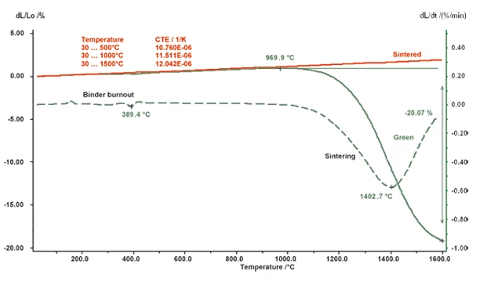
  <figcaption markdown>Dilatometric curves for yttria-stabilized zirconia: green body (solid green line) and sintered ceramic (solid red line). Dashed green line is the derivative of the solid green line. (from the [Netzsch website](https://analyzing-testing.netzsch.com/en/applications/ceramics-glass/zirconia-sintering))</figcaption>
</figure>

The densification rate is related to the linear shrinkage rate, which can actually be measured by dilatometry, as

$$-\frac{\mathrm{d} L}{L\mathrm{d} t} = -\frac{\mathrm{d} \rho}{3\rho \mathrm{d} t},$$

or, in the integral form,

$$\rho = \frac{\rho_0}{\left( 1 + \frac{\Delta L_\mathrm{sinter}}{L_0}\right)^3} \label{rho},$$

where $\rho_0$ is the density of the green compact. Please note that $\Delta L_\mathrm{sinter}$ in Equation $\ref{rho}$ refers only to the length change in the sintering process itself. All non-isothermal sintering occurs simultaneously with thermal expansion, which should be subtracted from the measured $\Delta L$ value to obtain $\Delta L_\mathrm{sinter}$ in non-isothermal conditions. But what exactly is thermal expansion?

### Thermal expansion

ASTM E 228[^2] defines fairly accurately[^7] the most important terms related to thermal expansion, which are quoted and commented on below.

> *linear thermal expansion*, $\Delta L / L_0$, the change in length relative to the initial length of the specimen accompanying a change in temperature, between temperatures $T_0$ and $T_1$

$$\varepsilon _\mathrm{therm} = \frac{\Delta L}{L_0} = \frac{L_1 - L_0}{L_0}$$

$\varepsilon$ is sometimes called "strain".

> *mean (average) coeffıcient of linear thermal expansion*, $\alpha _m$, the ratio between the expansion and the temperature difference that is causing it. It is referred to as the average coefficient of thermal expansion for the temperature range between $T_0$ and $T_1$

$$\alpha _m = \frac{1}{L_0} \frac{\Delta L}{\Delta T} \label{techTEC}$$

The most common abbreviations for the $\alpha$ coefficients are:

- TEC - thermal expansion coefficient
- LTEC - linear thermal expansion coefficient
- CTE - coefficient of thermal expansion

$\alpha _m$ is also known as the "technical TEC" for its technological significance: by multiplying its value by $\Delta T$, we immediately get the relative elongation $\varepsilon$ between two temperatures.

> *thermal expansivity (instantaneous coeffıcient of thermal expansion)*, $\alpha _L$, identical to the above, except that the derivative replaces the finite differences of Equation $\ref{techTEC}$. The thermal expansivity is related to the length change for an infinitesimally narrow temperature range, at any temperature $T$ (essentially a “tangent” point)

$$\alpha _L = \frac{1}{L} \left( \frac{\partial L}{\partial T} \right)_p  \label{physTEC}$$

$\alpha _L$ is also known as the "physical TEC".[^8]

What trends can we expect of the values of $\varepsilon$ and $\alpha$? How do they typically change with temperature? Thermal expansion in solids is caused by the atomic vibrations in crystal lattices being anharmonic.[^9] Via thermodynamic and statistical mechanics calculations, one can derive the relationship between the [Grüneisen parameter](https://en.wikipedia.org/wiki/Gr%C3%BCneisen_parameter) ($\gamma$) and volumetric TEC ($\alpha_V$):

$$\alpha _V (T) = \frac{1}{V} \left( \frac{\partial V}{\partial T} \right)_P = \gamma \frac{C_V}{V_m}\chi _T$$

where $V_m$, $C_V$, and $\chi _T$ are the molar volume, the heat capacity at constant volume, and the isothermal compressibility, respectively.
Now, $\chi _T$ and $V_m$ for solids weakly depend on temperature; $\gamma$ is also almost temperature-independent (especially at $T$ well above the Debye temperature), and $C_V(T)$ is rather flat at high temperatures.
All of it means that in many simple (thermal-expansion-only) cases $\varepsilon$ is almost linear and $\alpha$ can be treated as a constant. This is the case, for instance, for the thermal expansion of sintered zirconia (red line in the figure above). In a very wide temperature range, however, some temperature dependence of TEC is anticipated (see the figure below).

<figure markdown>
  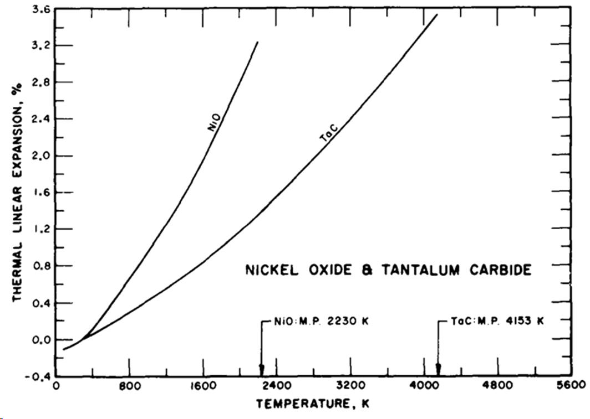{ width="500" }
  <figcaption markdown>Linear expansion, $100\frac{\Delta L}{L_0}$, of $\ce{NiO}$ and $\ce{TaC}$[^9]</figcaption>
</figure>

### Anomalies

In addition to just the thermal expansion, we can observe different anomalies on the dilatometric curves of the sintered polycrystalline oxide ceramics. These anomalies include:

- shrinkages caused by creep and sintering (can be often seen at high $T$ or during the high-temperature isothermal dwells)
- chemical reactions inside the sample (interactions, decompositions) for unstable or composite samples (e.g., there's pyrolysis of the binder in the figure with zirconia above)
- phase transitions (only those accompanied by perceptible size changes)
- chemical reactions with the atmosphere (oxygen exchange, hydration/dehydration, etc., depending on the atmosphere)

Let's now discuss the last two.

#### Phase transitions

A transition for which the nth derivative of the chemical potential is discontinuous can be classified as an nth-order phase transition. Thus, as volume is the first derivative of the Gibbs free energy, $G$,

$$\left( \frac{\partial G}{\partial p} \right)_T = V,$$

and $\alpha$ is the second derivative,

$$\left( \frac{\partial^2 G}{\partial p \partial T} \right) = \left( \frac{\partial V}{\partial T} \right)_p = \alpha _V,$$

we can expect the first- and second-order phase transitions to be seen on the $\varepsilon (T)$ and $\alpha (T)$ dependences. Two such examples are given below.

<figure markdown>
  { width="500" }
  <figcaption markdown>Linear expansion of $\ce{SiO2}$: first-order phase transition[^9]</figcaption>
</figure>

<figure markdown>
  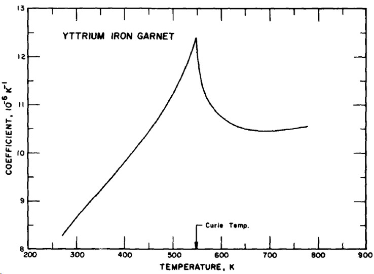{ width="500" }
  <figcaption markdown>TEC of $\ce{Y3Fe5O_{12}}$: second-order phase transition[^9]</figcaption>
</figure>

#### Oxygen/water exchange

There are two phenomena that often manifest on dilatometric curves of nonstoichiometric complex oxides. Both of them, oxygen exchange and water exchange, are related to the equilibria between the sample and the components of the surrounding gas atmosphere. Due to the fact that these phenomena result from the changes in the *chemical composition* (oxygen content or water content in the crystal lattice of the oxides), the associated changes in linear dimensions and volume are called *chemical expansion*. Let us now consider the possible origins of chemical expansion and how it appears on dilatometric curves in the simpler cases.

The process of reduction (i.e., oxygen loss) upon heating for many oxides can be written, in Kröger-Vink notation, as

$$\ce{O^{\times}_O + 2M^{\bullet}_M <=> \frac{1}{2}O_2 + V^{\bullet \bullet}_O + 2M^{\times}_M},$$

where metals that can change their oxidation state can act as $\ce{M}$ (e.g., $\ce{Co}$, $\ce{Fe}$). It is seen that the oxygen release is accompanied by the oxygen vacancy formation and the reduction of the metal cations. Both, especially the latter, can influence the size of the crystal lattice through the change in the size of the nodes in it. For instance, cations with lower oxidation state are larger,[^10] and so the reduction of the cations contributes to expansion.

In the figure below, following the first-order phase transition at 275 °C, you can see a pronounced upward trend in the dilatometric curve. This deviation from expected more or less linear expansion is due to oxygen release.

<figure markdown>
  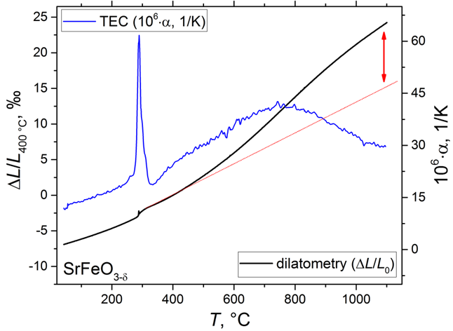{ width="450" }
  <figcaption markdown>Reduction-induced chemical expansion example: red arrow shows the deviation due to oxygen release[^11]</figcaption>
</figure>

Please note that usually chemical expansion is not associated with any phase transitions, so the occurrence of the phase transition in this case is purely coincidental.

In turn, hydration, which is observed only in some nonstoichiometric oxides (in a small fraction of them, in fact), can be expressed as

$$\ce{O^{\times}_O + V^{\bullet \bullet}_O + H2O <=> 2OH^{\bullet}_O}.$$

The origins of this phenomenon are less clear,[^13] but they are also, undoubtedly, related to the defect chemistry and to different defect species present in hydrated and dehydrated crystal lattices of oxides, respectively. In the figure below you see how the length of the sample may change in the temperature region in which the hydrated oxide actively loses lattice water (200-600 °C, blue line). Thus, water uptake contributes to expansion, and its release causes shrinkage.

<figure markdown>
  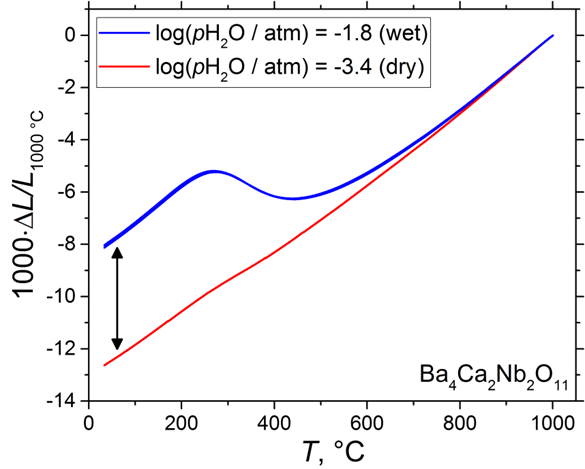{ width="450" }
  <figcaption markdown>Hydration-induced chemical expansion example: the black arrow shows the difference between the dilatometric curves measured in wet and dry air; the red curve corresponds to the sample annealed in dry air (dehydrated)[^12]</figcaption>
</figure>

You can find out more about chemical expansion (expansion due to the change in the chemical composition via substitution, oxygen exchange or hydration) in oxides and its measurement in the corresponding literature.[^13]

And, of course, in order to definitely attribute the anomalies observed in the dilatometric experiments to any physical phenomena, be it phase transitions or chemical expansion, you always need to support your claims with the results obtained by other methods, such as [thermogravimetric analysis](./thermogravimetry.md), X-ray diffraction, etc.

## Measurements

### Equipment

In this lab, we're using Netzsch DIL 402 PC, which is a horizontal push-rod dilatometer. In the following figure,[^14] it is shown with the movable oven slid all the way to the right, giving access to the sample holder.

<figure markdown>
  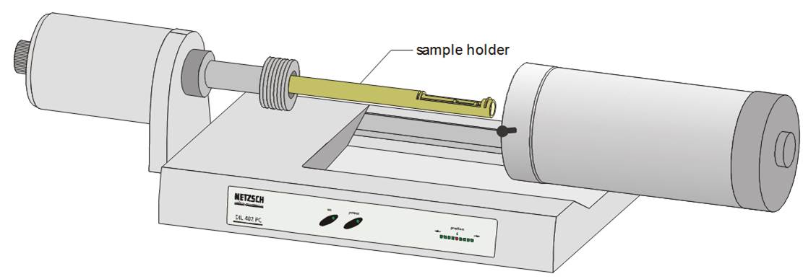
  <figcaption>Netzsch DIL 402: external view</figcaption>
</figure>

The furnace uses SiC heating element and a separate thermocouple near the heater for more precise temperature control. The protective gas-tight alumina tube allows different atmospheres to be used during the measurements.

<figure markdown>
  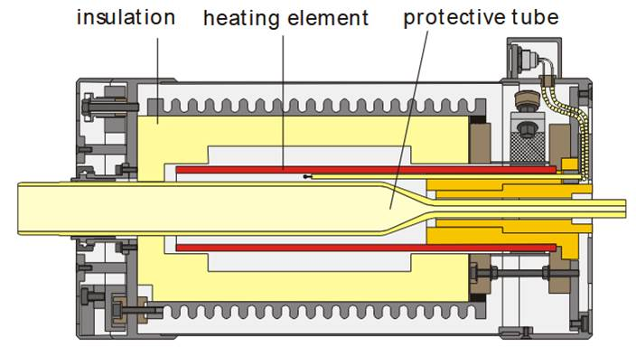{ width="400" }
  <figcaption>Netzsch DIL 402 high-temperature oven</figcaption>
</figure>

The working principle of all push-rod dilatometers is similar. The sample is placed inside the sample holder, which is usually a tube made of fused silica or, for higher-temperature applications, high-purity alumina (or even graphite or tungsten for extreme temperatures). The sample is firmly held between the holder and a movable spring-loaded pushrod, which exerts very small pressure on the sample (the load is below 50 cN).

<figure markdown>
  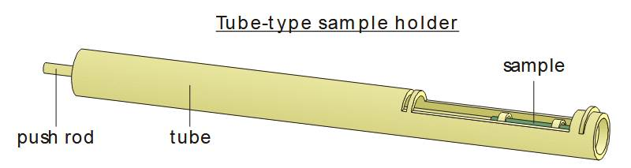{ width="600" }
  <figcaption>Netzsch DIL 402 sample holder</figcaption>
</figure>

The sample holder with the sample inside is inserted into the oven that heats up the sample. The corresponding changes in the sample length are transmitted, via the pushrod, to the length sensor, or displacement transduser. In Netzsch DIL 402 as in many other dilatometers the transducer is inductive (linear variable differential transformer, or [LVDT](https://en.wikipedia.org/wiki/Linear_variable_differential_transformer)), although different optical sensors are becoming quite popular. The length changes measured by the transducer are recorded along with the temperature, which is measured with a thermocouple placed very close to the sample.

<figure markdown>
  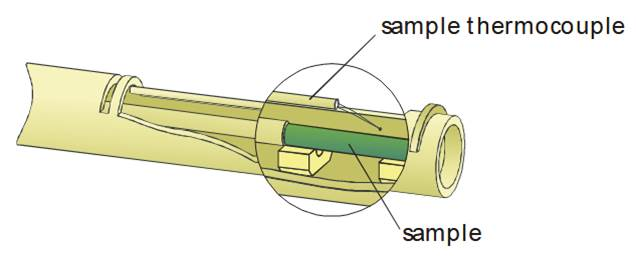{width="400"}
  <figcaption>Sample thermocouple positioning</figcaption>
</figure>

The main parts of the dilatometer are shown in the figure below. Please note that the temperature inside the chamber with the sensor is maintained by an external circulating thermostat (not shown).

<figure markdown>
  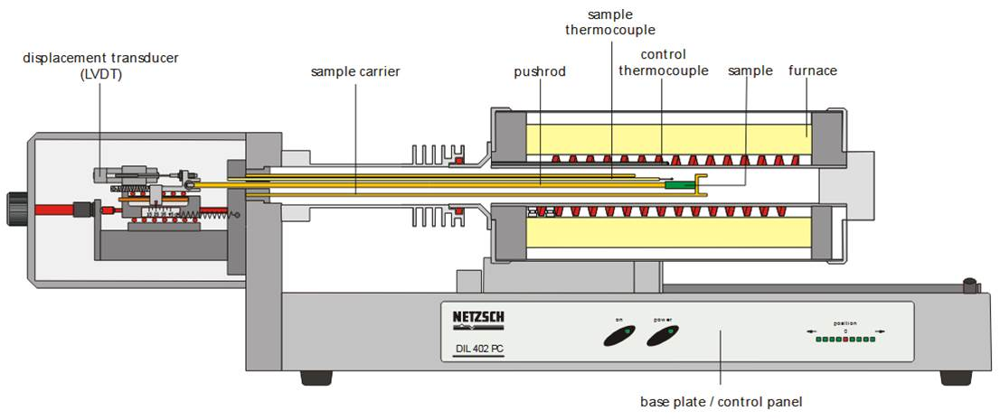
  <figcaption>Netzsch DIL 402 schematic</figcaption>
</figure>

### Correction

Because both the sample and the sample holder are heated in the oven, exhibiting thermal expansion, push-rod dilatometers always measure the difference in expansion between the specimen and the portion of the sample holder that is positioned parallel to it. Hence, the correction is needed to calculate the real expansion of the sample. The corresponding procedure is fairly standard.[^2] In a correction experiment, which is performed with a sample made of reference material with known thermal expansion, $\left( \Delta L / L_0 \right)_\mathrm{ref} = f(T)$, the temperature-dependent correction coefficient $A$ is found:

$$A = \left( \frac{\Delta L}{L_0} \right)_\mathrm{ref} - \left( \frac{\Delta L}{L_0} \right)_\mathrm{meas} \label{dilcorr}$$

High-purity platinum, tungsten, copper, alumina or quartz are among the commonly used reference materials.

In the subsequent measurements, corrected thermal expansion is calculated from the measurement results as

$$\left( \frac{\Delta L}{L_0} \right)_\mathrm{corr} = \left( \frac{\Delta L}{L_0} \right)_\mathrm{meas} + A. \label{dilmeas}$$

In most cases, such calculations can be done automatically in the dilatometric data analysis software.

The lengths of the standard (reference) and the measured samples should be as close as possible. The conditions in both the measurement and the correction experiments should be the same, including the temperature change rates, dwell times, sweep gas compositions and flow rates, etc. All these variable parameters influence, to some extent, the small but inevitable temperature lags and temperature gradients along and across the measurement cell. It should be clear that these thermal effects should be equal in the respective measurements to be able to use Equations $\ref{dilcorr}$-$\ref{dilmeas}$.

Temperature is also one of the measurement signals in dilatometry. For the most precise measurements, temperature calibration is performed using high-purity metals with well-known melting points. This calibration is based on abrupt length changes observed upon melting.[^15]

### Procedure

We consider here only the sample measurements because the correction measurement procedures would be exactly the same.

The samples taken for the sintering measurements are usually pre-compacted powders (e.g., pellets made by [uniaxial pressing](./pressing.md)), sometimes called "green compacts" or "green bodies". Due to the relatively high shrinkage in the process, the green pellet length is usually not very high (several mm) to prevent exceeding the measurement range of the dilatometric sensor.

In turn, to avoid the shrinkages caused by sintering, thermal expansion is investigated using pre-sintered ceramic samples, most often shaped as bars, cylinders or pellets.

Regardless of the particular shape of the sample, there is one requirement that all dilatometric samples must meet. As seen in the figure below, the sample within the sample holder rests on the supports while being pushed against the holder by the pushrod.

<figure markdown>
  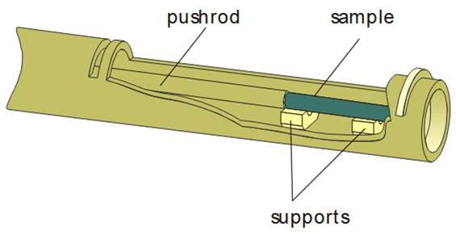{width="400"}
  <figcaption>Sample inside the sample holder</figcaption>
</figure>

Hence, *the opposite sides* of the sample that are in contact with the pushrod and the "base" of the holder (formed by a removable slide) *must be flat and parallel*. Because of this, the actual measurement procedure starts with the preparation of the sample.

1. If the opposite sides of the sample are not flat and parallel, prepare the sample accordingly by mechanical means (diamond cutting wheels, grinding tools, small files, sandpaper, etc.).
2. When the sample is ready, measure its length with a micrometer.
3. Open the dilatometer by sliding the oven all the way to the right after loosening the retaining nut on the protective tube.
4. Retract the pushrod using the buttons on the base plate of the dilatometer.
5. Position the sample onto the alumina supports inside the sample holder.
6. Insert the pushrod, bringing it in contact with the sample. To prevent the interaction between the sample, the pushrod and the sample holder parts, use spacers as shown:
    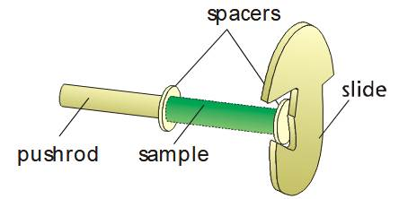{width="300"}
    
    You may need to hold the leftmost spacer with tweezers while sliding the pushrod.

7. As the pushrod is somewhat movable, small adjustments to its position as well as the positions of the sample and the spacers can be made at this time.
8. Slide the furnace to the left and tighten the retaining nut, which will compress the O-ring inside and seal the internal space of the dilatometer.
9. Now you should set the experiment parameters, including the name of the sample, the initial length, the temperature program, the sweep gases, and so on. All of it is done in the software.
10. Depending on the gas atmosphere used for the measurements, you may need to wash the dilatometer with the working gas before starting the experiment.

## Interpretation

Dilatometry is a non-specific method. Its results tell that something, which is accompanied by noticeable length/volume changes, happens in certain conditions ($T$, $p$). The results don’t tell what that something is. The dilatometry results are interpreted based on experience (you may know what usually happens with similar compounds at similar conditions) and additional experiments ([thermogravimetry](./thermogravimetry.md), X-ray diffraction, etc.).

[^1]: IUPAC Gold Book definition, [https://doi.org/10.1351/goldbook.T06314](https://doi.org/10.1351/goldbook.T06314)
[^2]: ASTM E 228-22 "Standard Test Method for Linear Thermal Expansion of Solid Materials With a Push-Rod Dilatometer", [https://doi.org/10.1520/E0228-22](https://doi.org/10.1520/E0228-22)
[^3]: Most of the "sintering" section is based on: Rahaman, M.N. (2007). Sintering of Ceramics (1st ed.). CRC Press. eISBN 9780429128424. [https://doi.org/10.1201/b15869](https://doi.org/10.1201/b15869)
[^4]: The definition is taken from: Randall M. German, Sintering: from Empirical Observations to Scientific Principles, Butterworth-Heinemann, 2014, ISBN 9780124016828, [https://doi.org/10.1016/C2012-0-00717-X](https://doi.org/10.1016/C2012-0-00717-X)
[^5]: see, e.g., Chapter 2.6.2 of Ref. 3
[^6]: 
    see, e.g., how the Master Sintering Curve (MSC) approach can be used for predicting the densities of the sintered bodies:

    Su, H. and Johnson, D.L. (1996), Master Sintering Curve: A Practical Approach to Sintering. Journal of the American Ceramic Society, 79: 3211-3217. [https://doi.org/10.1111/j.1151-2916.1996.tb08097.x](https://doi.org/10.1111/j.1151-2916.1996.tb08097.x)

    K. Rajeswari, S. Padhi, A.R.S. Reddy, Roy Johnson, Dibakar Das. Studies on sintering kinetics and correlation with the sinterability of 8Y zirconia ceramics based on the dilatometric shrinkage curves. Ceramics International, 39(5), 2013, 4985-4990, [https://doi.org/10.1016/j.ceramint.2012.11.095](https://doi.org/10.1016/j.ceramint.2012.11.095)

    T. Frueh, I.O. Ozer, S.F. Poterala, H. Lee, E.R. Kupp, C. Compson, J. Atria, G.L. Messing, A critique of master sintering curve analysis, Journal of the European Ceramic Society, 38(4), 2018, 1030-1037, [https://doi.org/10.1016/j.jeurceramsoc.2017.12.025](https://doi.org/10.1016/j.jeurceramsoc.2017.12.025)
[^7]: ...only some equations are not quite correct. What, for instance, exactly is $\left( \frac{\mathrm{d} L}{\mathrm{d} T} \right)_T$ ?
[^8]: Equation $\ref{physTEC}$ is written here in a "strict" way. However, in some sources, including ASTM E 228-22 (ref. 2) and the Netzsch manuals, $\alpha _L$ is defined as $\alpha _L = \frac{1}{L_0} \left( \frac{\mathrm{d} L}{\mathrm{d} T} \right)_P$ with $L_0$ instead of $L$. This is mostly done for simplicity and because for any reasonable $L_0$ and $\Delta L$ values in typical dilatometric experiments the error introduced by replacing $L$ with $L_0$ would be negligible.
[^9]: S. Touloukian Y, K. Kirby R, R. Taylor E, Y. R. Lee T. Thermophysical Properties of Matter - the TPRC Data Series. Volume 13. Thermal Expansion - Nonmetallic Solids. New York: IFI/Plenum Data Company; 1977. [https://apps.dtic.mil/sti/citations/ADA129116](https://apps.dtic.mil/sti/citations/ADA129116)
[^10]: Shannon R. Revised effective ionic radii and systematic studies of interatomic distances in halides and chalcogenides. Acta Crystallographica Section A. 1976;32(5):751-67. [https://doi.org/10.1107/S0567739476001551](https://doi.org/10.1107/S0567739476001551). See also [http://abulafia.mt.ic.ac.uk/shannon/ptable.php](http://abulafia.mt.ic.ac.uk/shannon/ptable.php)
[^11]: V.V. Sereda, D.S. Tsvetkov, I.L. Ivanov, A.Yu. Zuev, Interplay between chemical strain, defects and ordering in Sr1-xLaxFeO3 materials, Acta Materialia, 162, 2019, 33-45, [https://doi.org/10.1016/j.actamat.2018.09.051](https://doi.org/10.1016/j.actamat.2018.09.051)
[^12]: Vladimir V. Sereda, Dmitry S. Tsvetkov, Dmitry A. Malyshkin, Ivan L. Ivanov, Anton L. Sednev-Lugovets, Andrey Yu. Zuev, Hydration-induced chemical expansion of BaCa(1+y)/3Nb(2−y)/3O3−δ∙xH2O (BCN) and other proton-conducting perovskite oxides, Solid State Ionics, 358, 2020, 115516, [https://doi.org/10.1016/j.ssi.2020.115516](https://doi.org/10.1016/j.ssi.2020.115516)
[^13]: 
    Zuev A.Y., Tsvetkov D.S. (2017). Conventional Methods for Measurements of Chemo-Mechanical Coupling. In: Bishop, S., Perry, N., Marrocchelli, D., Sheldon, B. (eds) Electro-Chemo-Mechanics of Solids. Electronic Materials: Science & Technology. Springer, Cham. [https://doi.org/10.1007/978-3-319-51407-9_2](https://doi.org/10.1007/978-3-319-51407-9_2)

    Tsvetkov D.S., Sereda V.V., Malyshkin D.A., Ivanov I.L., Zuev A.Y. Chemical lattice strain in nonstoichiometric oxides: an overview. Journal of Materials Chemistry A. 2022;10(12):6351-75. [https://doi.org/10.1039/D1TA08407K](https://doi.org/10.1039/D1TA08407K)
[^14]: The figures in this section are from the Netzsch DIL 409 operation manual.
[^15]: Henderson, J.B., Emmerich, W.D. & Wassmer, E. A method for the temperature calibration of pushrod dilatometers. Journal of Thermal Analysis 32, 1905–1913 (1987). [https://doi.org/10.1007/BF01913983](https://doi.org/10.1007/BF01913983)