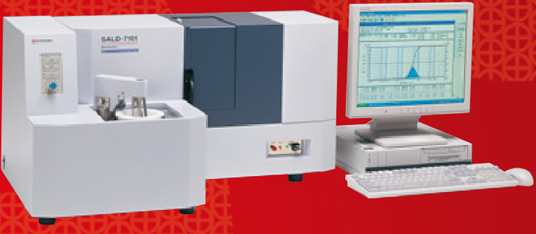
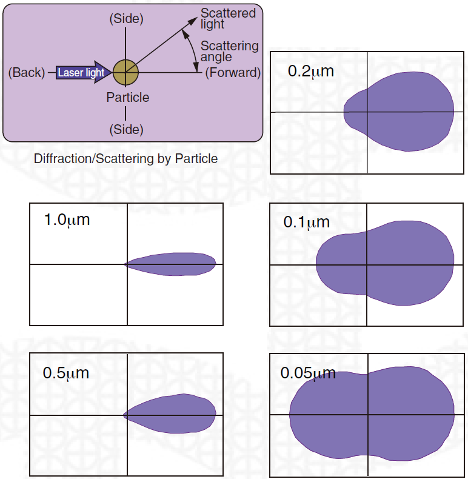
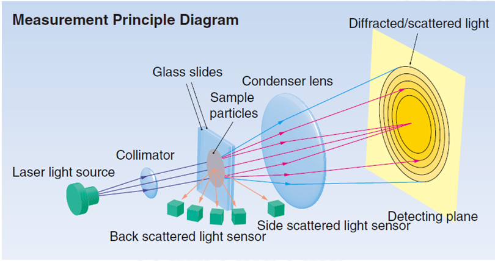
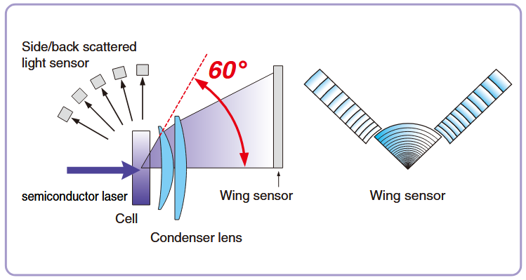
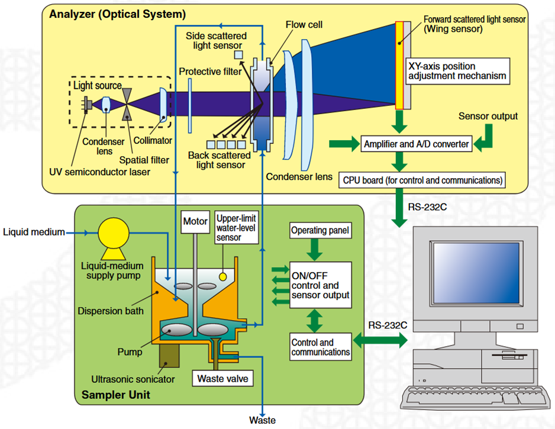
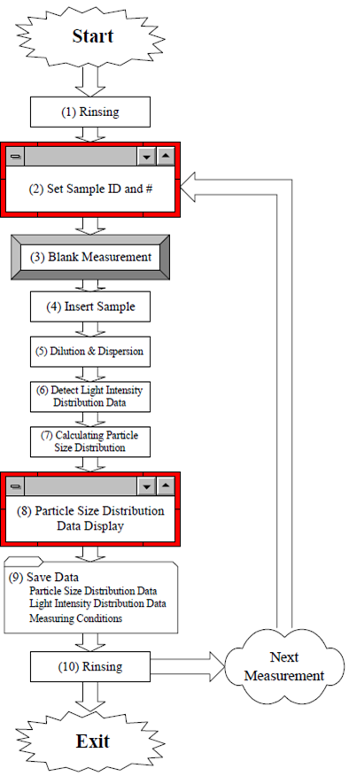

# Particle size analysis

For the particle size analysis, we're going to use the following equipment,[^1] which utilizes the [Laser Diffraction](https://en.wikipedia.org/wiki/Laser_diffraction_analysis) method:

<figure markdown>
  { width="400" }
  <figcaption>Shimadzu SALD-7101 Laser Diffraction Particle Size Analyzer: sampler (left) and measurement unit (center)</figcaption>
</figure>

## Measurement principle

When a particle is irradiated with a laser beam, light is emitted from the particle in every direction. This is “scattered light”. The intensity of the scattered light varies with the scattering angle and describes a spatial intensity distribution pattern. This is a “light intensity distribution pattern”. If the particle diameter is large, the scattered light emitted from the particle is concentrated in the forward direction (i.e., the direction of the laser beam), and fluctuates intensely in a small angular range. Compared to the light emitted in the forward direction, the intensity of all other light is extremely low. As the particle diameter becomes smaller, the pattern of the scattered light spreads outwards. As the particle becomes even smaller, the intensity of the light emitted to the side and backwards becomes higher. 

<figure markdown>
  
  <figcaption>Relationship between particle diameter and light intensity distribution pattern</figcaption>
</figure>

In this way, then, there is exists a one-to-one correspondence between the particle diameter and the light intensity distribution pattern. This means that the particle diameter can be ascertained by detecting the light intensity distribution pattern.

The scattering pattern dictates the sensor arrangement:

<figure markdown>
  
  <figcaption>Measurement principle diagram</figcaption>
</figure>

<figure markdown>
  
  <figcaption>Sensor arrangement</figcaption>
</figure>

## Schematics

<figure markdown>
  
  <figcaption>The figure shows in detail how the sampler unit (basically, the external stirred bath) is connected to the analyzer (where the laser, the measurement cell and the sensor are located)</figcaption>
</figure>

- The particles, which are dispersed in a liquid medium, are circulated between the flow cell and the sampler dispersion bath. The flowcell is set in the measurement unit, while measurement is performed.
- The dispersion bath incorporates a stirrer and an ultrasonic sonicator.
- The dispersed suspension is delivered to the flow cell by a pump.

## Measurements

<figure markdown>
  
  <figcaption>Measurement workflow</figcaption>
</figure>

## Limitations

Measurement range: 10 nm (0.01 μm) to 300 μm

For the most precise measurements, the particles should be:

- of the same composition
- spherical
- preferably, with known complex refractive index

Another limitation is that the algorithms used in laser diffraction analysis seem to be proprietary and may differ between the setups.

[^1]: the text and the pictures here are mostly from the [Shimadzu](https://www.shimadzu.com/) brochure and operation manual