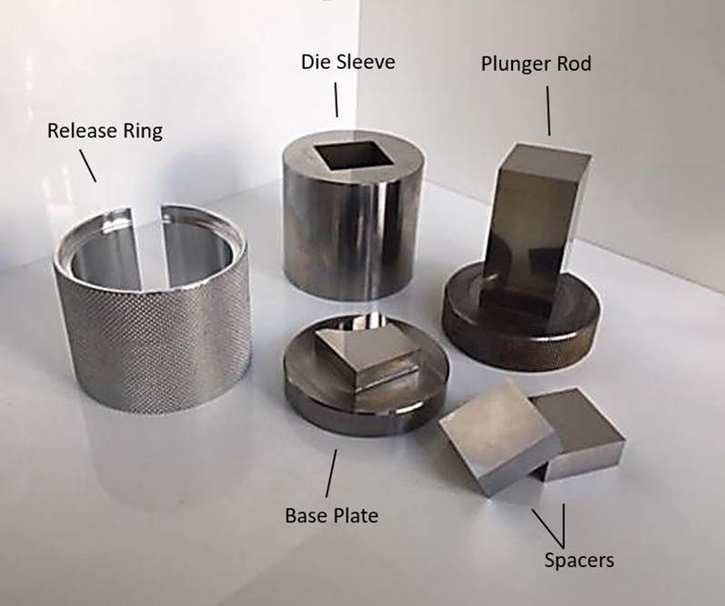
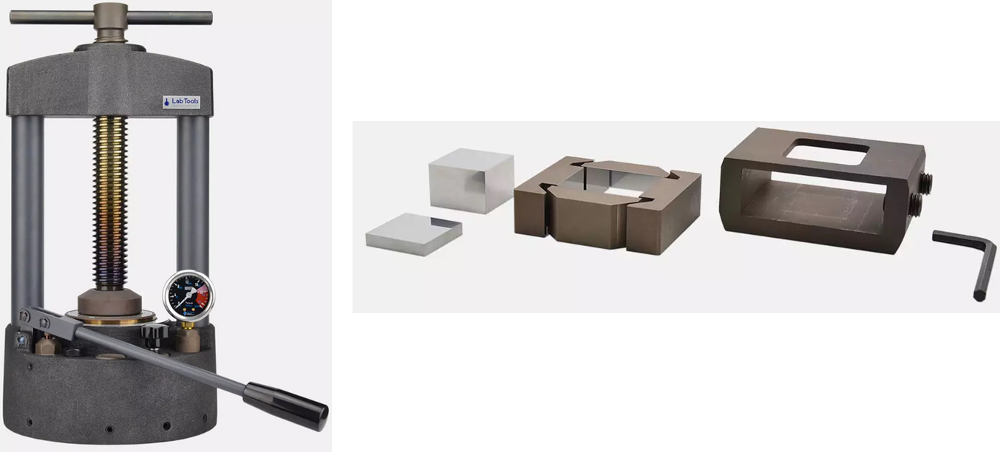

## Uniaxial pressing of powders

In the previous labs, we obtained polycrystalline powders of complex oxides.

In this lab we are making ceramic bars from these powders to use in the subsequent measurements (dilatometry and scanning electron microscopy). The technique is called "uniaxial pressing", and the main equipment is:

- **manual hydraulic press** for applying the pressure to the die set.
- **die set**, also known as the "die assembly". Its parts should be made of high-quality stainless steel, and those sides that during the pressing exhibit friction or are in contact with the powder should be well-polished.

The parts of a typical disassembled die set can be seen in the following figure.

<figure markdown>
  { width="560" }
  <figcaption markdown>Die set anatomy ([source](https://www.pelletpressdiesets.com/products/12-7x12-7-square-pellet-press-die-set))</figcaption>
</figure>

You can see below the photos of the press and the die set such as the ones that we actually use. This die set is somewhat different from the one above: it features split inner die sleeve for easier removal of the pressed bars. The images were taken from the manufacturer's website (in Russian).

<figure markdown>
  
  <figcaption markdown>Hydraulic press (left, [source](https://www.labtools.ru/products/laboratory-presses/plg-20)) and die assembly (right, [source](https://www.labtools.ru/products/press-forms/square-collapsible))</figcaption>
</figure>

The basics of how to use the die set can be grasped from the video below, made by some general lab equipment supplier ([MSE Supplies](https://www.msesupplies.com/blogs/news/pellet-press-die-sets)). Please pay attention to the greasing of the plunger surface with the "baby oil" (vaseline) before assembling the die set.

<iframe width="560" height="315" src="https://www.youtube-nocookie.com/embed/gMOZbGH7nIo?si=ct2tQJ5ExMYk05Vh" title="YouTube video player" frameborder="0" allow="accelerometer; autoplay; clipboard-write; encrypted-media; gyroscope; picture-in-picture; web-share" allowfullscreen></iframe>

There are many videos on YouTube on the sample preparation for FTIR spectroscopy in transmission mode with KBr pellets; you may also find those videos useful.

## Procedure

1. Prepare the powder. We can use an aqueous solution (5 wt.%) of polyvynyl alcohol (PVA) as a binder to help us handle the freshly pressed bars. Before pressing, 4-5 drops of the binder are added to ca 10 g of the powder, which is then regrinded to homogenize the mixture.
2. Disassemble and clean the die set.
3. Coat the moving surfaces of the die set (of the sleeve and plunger die) with a thin layer of vaseline.
4. Assemble the die set and pour some powder into it, trying to distribute the powder more or less evenly across the bottom.
5. Insert the plunger and tighten the screws on the outer die sleeve.
6. Insert the die set into the press and tighten the top screw by hand. The pressure valve should be open during the process.
7. Close the pressure valve and start pumping. The base plate will begin to move upwards bulding up the pressure in the die set. Continue pumping until the manometer shows 4 metric tons. Please note that choosing the right pressure may be tricky. If the sample crumbles easily after pressing, the pressure may be too low. If it "delaminates", i.e., develops long cracks or even layered structure in the dimensions perpendicular to the axis along which the pressure was applied, the pressure may be too high.
8. Wait a few minutes.
9. Open the valve to release the pressure, raise the top plate by loosening the big screw on top of the press, and remove the die set from the press.
10. Disassemble the die set and carefully remove the freshly pressed green bar.
11. When you're finished, clean the die set and coat all its surfaces with vaseline to prevent their corrosion during storage.

The subsequent sintering is carried out at a temperature about 100 °C higher than the highest temperature at which the green powder was last calcined.