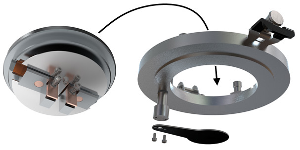

# Sample preparation for SEM and EDS

Scanning electron microscopy (SEM)[^1] is an imaging technique that is based on the interaction of a high-energy (up to 30 keV) electron beam with the objects of study. Energy-dispersive spectrometry (EDS) capability is realized in some microscopes via a separate EDS detector. This technique enables the elemental analysis by quantifying the characteristic X-ray radiation emitted from the sample under the electron beam.

## Requirements

The things that we can put into a scanning electron microscope for imaging and elemental analysis had better be:

1. **Stable in vacuum**, which in the SEM specimen chamber is usually high (e.g., $10^{-2}$ Pa). Low-vacuum imaging (Variable Pressure SEM) is available as an option only in some microscopes.
2. **Stable under the electron beam**, which due to its high energy and small diameter can cause radiation damage to some (mostly, but not only, organic) materials.
3. **Conductive**. "How conductive exactly" is a tricky question and it's mostly a matter of trial and error to determine whether the sample is conductive enough. What's perfectly clear is that there should be a path to the electrical ground from any point onto which the electron beam falls during the SEM measurements. Consider this: where do all the electrons from the beam go after encountering the sample? The equation for the electron currents is as follows:

$$ i_\mathrm{B} = i_\mathrm{BSE} + i_\mathrm{SE} + i_\mathrm{SC}, $$

where $i_\mathrm{B}$, $i_\mathrm{BSE}$, $i_\mathrm{SE}$, and $i_\mathrm{SC}$ are the incident beam current, the backscattered electron (BSE) current, the secondary electron (SE) current and the specimen current, respectively. Both BSE and SE electrons fly away, and some of them hit the respective detectors and produce the useful signals for the SEM imaging. However, the fraction of the electron beam current that is absorbed by the sample, $i_\mathrm{SC}$, should also go somewhere. If there is no path to the ground from the sample via the specimen stage of the microscope, the absorbed electrons will accumulate in the sample, and their electrostatic field will decelerate and deflect the incident beam, producing the so-called charging artefacts in the SEM images.

Those three in the list above are the most general requirements. The first condition is absolute - if a sample is not stable in any vacuum, it cannot be used for SEM. The issues arising from the non-compliance with the second and third requirements are the radiation damage and the charging, respectively. Both can be, to some extent, compensated (but not eliminated!) by adjusting the measurement parameters such as the electron beam energy and current and the frame time (or scanning rate) of the image acquisition.

For the most accurate (semi-quantitative or quantitative) EDS analysis, the sample should also be:

1. **Homogeneous** in terms of the density and the chemical composition throughout the entire volume in which the characteristic X-rays are generated under the incident electron beam;
2. **Flat** and highly polished so that no physical surface defects, such as scratches, pits, and so on, could either modify the interaction of the electron beam with the specimen or alter the subsequent X-ray absorption path length to the detector compared to an ideal flat bulk specimen. This is because the underlying assumption in the EDS quantification algorithms is that the incident electron beam falls perpendicular to the smooth sample surface, and any deviation from this geometry may influence the results obtained.

See also the Goldstein's[^2] very detailed discussions on how the unevenness of the sample surface may distort the EDS results.

## Samples

The following short discussion is related primarily to the *polycrystalline ceramic materials*. Quite exhaustive information on various other sample preparation, from inorganics to biological specimens, can be found in the textbooks such as the one that heavily influenced the following text.[^3]

So, we may be interested in the following properties of powdered or sintered ceramics:

- *microstructure*, or [morphology](https://doi.org/10.1351/goldbook.MT07285). In this case, only the [coating](#coating) may be required if the material is not conductive enough and exhibits charging. Depending on the task at hand, either *powders* or *sintered ceramic products* can be used.
- *composition*, in which case we definitely need EDS analysis. As the interpretation of the EDS results from the *powders* or *sintered ceramic products* may be hindered by the complex microstructure of the raw sample surfaces,[^2] for the best EDS analysis, [grinding and polishing](#grinding-and-polishing) is required. If the sample is small, fragile or oddly shaped and does not allow its convenient handling during polishing, an additional [mounting](#mounting) step is necessary. The subsequent [coating](#coating) may or may not be needed depending on the conductivities of the sample and the mounting medium.

Please also note that some morphological studies may also benefit from mounting, grinding and polishing, as it is easier to determine the grain sizes and grain boundaries from the images of the polished surfaces.

For various reasons, and not in the least because of the practical importance of metals and alloys, the combination of mounting, grinding, polishing, and coating is often called "metallographic sample preparation".

## Mounting

Mounting, or embedding, is performed for small, fragile, or oddly shaped specimens, fractures, or in instances where the specimen edges are to be examined[^4] to make the specimens easier to handle. The purpose of the process is to fix the samples firmly within the bulk of solid polymeric material.

Two major groups of mounting techniques can be recognized:

- *Hot methods* use thermosetting materials that flow when heated under high pressure and polymerize to form a stable material. Commonly used thermosetting materials are bakelite (a phenol-formaldehyde resin) and diallyl phthalates. Hot methods involve specialized compression mounting equipment, high temperatures (a few hundred °C) and pressures (up to several tens of MPa), and so they are used to embed hard structurally stable inorganic materials inaffected by these conditions, such as minerals, rocks, semiconductors or metals.
- *Cold methods* use various liquid resins that are polymerized at low temperatures (room temperature or slightly higher, but lower than 100 °C). Cold methods are versatile and can be employed for embedding delicate samples.

Two general types of resin are used for cold mounting:

- *acrylic resins* harden very quickly, in a matter of minutes, and may be ground and polished shortly afterwards. Because of this, it is quite tricky to work with them, as everything should be done quickly. There is not even enough time to apply vacuum so as to achieve greater impregnation of the samples.
- *epoxy resins* take hours to cure (fully polymerize and harden), although gentle heating (e.g., up to 30-40 °C) helps to speed up the process. However, these resins remain viscous for tens of minutes after mixing with the hardener, which makes it possible to use vacuum infiltrations to completely embed porous samples, drawing the resin into open cavities.

Being organic polymers, most resins are nonconductive and require [coating](#coating), although resins that contain conductive fillers (carbon or metal dust) are also available.

### Procedure

In this lab, we use epoxy resin (such as Buehler EpoThin 2) to cold-mount the sintered ceramic specimens. The procedure involves the following steps:

1. Mix the resin with the hardener in a ratio recommended by the manufacturer. The ratio may vary drastically between different kinds of epoxy resins, so always read instructions before mixing. Plastic cups (preferably, silicone cups, to which the resin doesn't stick) and wooden sticks are preferred for mixing. The mixing should be done thoroughly, but not excessively vigorously, so as not to create air bubbles within the agitated resin.
2. Put the samples into a silicone mold. Cylindrical molds (e.g., 2 cm OD, 2 cm high) such as ones that are used for making small homemade candles are very convenient for this purpose. The samples should be immobilized: they shouldn't have an opportunity to float inside the resin. Otherwise, they could float up during the vacuum treatment, which will result in their incomplete embedding. One way of immobilizing the samples consists in using appropriately sized binder clips in which ceramic pieces can be held tightly.
3. Pour the resin-hardener mixture over the samples that are fixed inside the silicone mold. Do not top up the mold; leave a few mm of free space on top.
4. Put the mold inside a vacuum cupboard (at room temperature) onto a paper sheet to prevent sticky resin from spilling directly into the cupboard.
5. Turn the vacuum on. Observe the air bubbles released from the mold. If the bubbling is excessive and form a foam cap that tends to get out of the mold, release the vacuum to collapse the foam, and then turn the vacuum on again.
5. Repeat step 5 until there are no bubbles anymore or until you get bored in case the bubbling doesn't stop.
6. Turn off the vacuum, take the mold out of the vacuum cupboard and leave it at rest somewhere for a specified amount of time. The curing time depends on the resin and should be specified by the manufacturer.

## Grinding and Polishing

The purpose of grinding and polishing, which are always performed in the stated order, is to obtain a flat sample surface. Although the general guidelines are more or less standard,[^4] the particular procedure depends strongly on the nature of the samples, the available tools, and the personal preferences of the operator.

Grinding is carried out by rubbing the specimen against abrasive material. It can be done in various ways, from rubbing on a stationary sandpaper to the use of automatic devices - grinding/polishing machines. The machines contain massive metallic rotating disks (typically, 8"/203 mm or 10"/254 mm in diameter, 1 or 2 per machine) with controlled rotation speed and direction. On top of these disks, different thin-plate disks called "platens" with embedded abrasive material, sandpaper disks, or disks with polishing cloth can be fixed. This way, one machine with a set of interchangeable abrasive disks can be used to perform all required grinding and polishing steps. The grinding/polishing machines can be automatic, where the samples are pressed to the abrasive disk and rotated contrary to the disk rotation by the machine head itself, or manual, in which the sample is held by the operator, and the machine controls only the rotation of the abrasive disk.

Grinding should start with the finest abrasive material capable of flattening the specimen and removing the artefacts from the previous operations, such as cutting. Grinding follows a series of similar steps, where the subsequent steps use finer abrasives than the previous ones. The abrasive grits are (rather inconveniently) expressed as either ANSI units, CAMI/FEPA units or approximate median particle diameters. The table below lists commonly used abrasive grit size designations and a correlation between different systems.[^4]

| FEPA        |           | ANSI/CAMI   |           |
|-------------|-----------|-------------|-----------|
| **Grit Number** | **Size (μm)** | **Grit Number** | **Size (μm)** |
| P120        | 125.0     | 120         | 116.0     |
| P150        | 100.0     | 180         | 78.0      |
| P220        | 68.0      | 220         | 66.0      |
| P240        | 58.5      | -           | -         |
| P280        | 52.2      | 240         | 51.8      |
| P320        | 46.2      | -           | -         |
| P360        | 40.5      | 280         | 42.3      |
| P400        | 35.0      | 320         | 34.3      |
| P500        | 30.2      | -           | -         |
| P600        | 25.8      | 360         | 27.3      |
| P800        | 21.8      | 400         | 22.1      |
| P1000       | 18.3      | 500         | 18.2      |
| P1200       | 15.3      | 600         | 14.5      |
| P1500       | 12.6      | 800         | 11.5      |
| P2000       | 10.3      | 1000        | 9.5       |
| P2500       | 8.4       | 1500        | 8.0       |

Polishing is usually distinguished from grinding by the use of loose abrasive particles embedded in an appropriately lubricated supporting soft material (e.g., special synthetic cloth). Diamond suspensions with several-μm-sized particles are used for rough and final polishing, and even finer colloid silica or alumina - for final polishing.

As I mentioned above, there is no universal grinding/polishing protocol. The particular examples for different samples can be found in the standards[^4] or grinding equipment manufacturers' application reports. However, some commonplace advice for machine-assisted processes can be formulated:

- start with the coarse (e.g., several tens of μm) grinding disks and move sequentially down to the finer ones, and then to the polishing cloth;
- spend from one to several minutes on grinding with each disk;
- the sample should be pressed to the disk with considerable force, typically in the range of 5-8 lbf (2.5-4 kgf) per 30 mm diameter mount;
- the sample can be moved in a circular path against the rotation of the disk to aid in grinding and polishing;
- the typical disk rotation speed is 200-300 RPM for grinding and 100-150 RPM for polishing;
- during grinding, water should be continuously supplied into the center of the disk to cool down the abrasive material and wash away the particulates;
- during polishing, water is not used, but suspensions and lubricants should be applied periodically to the cloth to keep it wet.

After grinding and polishing, the samples are washed for a few minutes in the ultrasonic bath.

### Procedure

For grinding and polishing of our epoxy-mounted ceramic samples, we use [ПОЛИЛАБ П12Лб](http://polylab.info/%d0%be%d0%b1%d0%be%d1%80%d1%83%d0%b4%d0%be%d0%b2%d0%b0%d0%bd%d0%b8%d0%b5-%d0%b8-%d1%80%d0%b0%d1%81%d1%85%d0%be%d0%b4%d0%bd%d1%8b%d0%b5-%d0%bc%d0%b0%d1%82%d0%b5%d1%80%d0%b8%d0%b0%d0%bb%d1%8b-%d0%b4/probopodgotovka-oborudovanie-i-stanki/shlifovalno_polirovalnye_stanki/polylab_p12/) manual polishing machine.

<figure markdown>
  { width="300" }
  <figcaption markdown>ПОЛИЛАБ П12Лб grinder/polisher (source - ПОЛИЛАБ П12Лб manual, in Russian)</figcaption>
</figure>

We have 75 μm, 18 μm, 10 μm and 6 μm diamond disks for grinding, and 1 μm diamond suspension along with the compatible glycol-based lube for polishing. We do not use finer silica suspension with ceramic samples because silica particles get stuck in ceramics and cannot be removed efficiently even with the ultrasonic cleaning.

1. Turn on the grinding machine.
2. Mount the roughest grinding disk onto the platen, fixing it with the clamp ring.
3. Turn on the rotation and water supply, adjust the rotation speed to 200-300 RPM.
4. Grind for up to several minutes.
5. Turn off the motor and close the water tap.
6. Remove the grinding disk.
7. Repeat steps 2-6 with different disks, moving sequentially from the roughest to the finest.
8. After the 6 μm diamond disk, install the cloth disk for polishing with the diamond suspension.
9. Apply the suspension to the cloth.
10. Turn on the rotation and adjust the speed to 150 RPM. Do not turn on the water tap.
11. Polish for several minutes. Apply the lube and suspension when necessary for the cloth to stay wet and diamond-filled.
12. Turn off the motor and the machine.
13. Rinse the sample with running water and then place it in the ultrasonic bath filled with distilled water for 5 minutes.

Handling of the polished surfaces should be done with care. You should not even touch the polished surface.[^5]

## Coating

How do we turn nonconductive specimens into conductive ones to use them in electron microscopy? We can do this by mixing them with a lot of something conductive (e.g., carbon or copper nanoparticles) until the continuous conductive pathways are created within the bulk of the material. However, for SEM we only need conductive surface of the sample and a conductive path connecting the surface to the ground. Hence, nonconductive samples are often coated with continuous nanolayers of conductive substances. The layers should be thin so as to preserve the original microstructure of the sample.

The major coating techniques are

- *evaporation*: conductive substance is heated (electrically) up to its vaporization temperature in vacuum and the evaporated particles condense on the surface that is being coated;
- *sputtering*: negative charged conductive metal target is bombarded by heavy positive ions created in the plasma (typically, argon plasma), and the atoms ejected from the target condense on the specimen surface.

Common substances used for coating include

- *metals* (e.g., Au, Pd, Pt, Al, Cr...);
- *carbon*.

Metallic coating provides excellent electrical and thermal conductivities. The latter may help in the imaging of heat-sensitive samples. However, it is relatively expensive both in terms of the coating substances (mostly, precious metals) and in terms of the coating techniques (especially if sputtering is used). In addition, metals, especially high-density metals such as Au, are good X-ray absorbers, so they may not be the best choice for the EDS analysis.

Carbon coating may not be suitable for very high resolution imaging due to the relatively poor electron yield of carbon and the risks of sample contamination during the coating. However, it is inexpensive, and it may be the best choice for the EDS analysis.[^6]

### Procedure

In this lab, we coat the samples with a thin carbon layer using vacuum evaporation technique with a [Quorum Q150R](https://www.quorumtech.com/q150r-rotary-pumped-sputter-coatercarbon-coater/) coater and pulsed cord evaporation technique.

<figure markdown>
  { width="350" }
  <figcaption>Quorum Q150 coater (source - Quorum Q150 series instruction manual)</figcaption>
</figure>

In the figure above, you see the cylindrical rotating sample stage in the center of the glass cylinder. Above the stage, in the lid, the insert with the electrodes is mounted into the outer ring of the lid assembly.

<figure markdown>
  { width="600" }
  <figcaption>Quorum Q150 clamp electrodes for carbon cord evaporation (left) and the lid assembly with the shutter detached (right). Source - Quorum Q150 series instruction manual.</figcaption>
</figure>

The general description of the coating process is as follows:

1. Place the sample onto the rotating stage. The stage is positioned about 60 mm above the base plate.
2. The carbon cord to be evaporated should be firmly fixed between the electrodes (see the figure above). We use a thin Quorum C5421 cord folded in six and tightly twisted.
3. The lid assembly features the shutter (see the figure above) to protect the sample surface during the outgassing. Before the coating, the shutter opens. The problem with this particular coater is that the shutter may get stuck. To prevent this, grab the shutter by hand and move it up, down, left and right a few times.
4. Close the lid, placing it onto the glass cylinder.
5. Turn on the coater, tap *Recipes* on its touch screen, then run the *Pump down* recipe for a few seconds several times. Ensure that the shutter works properly.
6. Open the *Pulsed cord* recipe. Ensure that the following process parameters are set:
    - Pulse length 10 s
    - Pulse count 1
    - Pulse current 60 A
    - Outgas current 9 A
    - Source outgas time 60 s
7. Run the *Pulsed cord* recipe. The recipe starts with evacuating the chamber. Push down onto the lid during the first seconds of pumping out to bring the lid assembly and the rubber seal on top of the glass cylinder close together.
8. Wait. When the pressure doesn't get any lower anymore, press *Skip to the process*.
9. The outgas current (9 A) will be passed through the cord for the specified time (60 s), after which the shutter will open, and the high-current (60 A) pulse will evaporate the cord, coating the sample surface.
10. After this, manually stop the current *Pulsed cord* recipe and run the *Vent* recipe to fill the chamber with ambient air.
11. Open the lid and remove the coated sample carefully. Remember that the coated surface should not be touched so as not to disrupt the very thin carbon layer.[^5]
12. Disassemble and clean the coater if necessary. This should be done at least after every several coatings.

## Selected videos

Below are two different videos showing how the metallographic sample preparation is actually performed.

<iframe width="560" height="315" src="https://www.youtube-nocookie.com/embed/UuHofNW40Yw?si=hEyZP640yvAVuBEQ" title="YouTube video player" frameborder="0" allow="accelerometer; autoplay; clipboard-write; encrypted-media; gyroscope; picture-in-picture; web-share" allowfullscreen></iframe>

<iframe width="560" height="315" src="https://www.youtube-nocookie.com/embed/ok42dVq2CU0?si=2l4H-wg7Qzb2s-qN" title="YouTube video player" frameborder="0" allow="accelerometer; autoplay; clipboard-write; encrypted-media; gyroscope; picture-in-picture; web-share" allowfullscreen></iframe>

If you'd like to delve deeper, there's also a [YouTube channel](https://www.youtube.com/channel/UCP8i7-Oi78qvo2EyqV3BdiA/videos) with several long detailed videos on the aspects of mounting and polishing. Or just search for the "metallographic sample preparation" techniques.

[^1]: See also the [IUPAC definition](https://doi.org/10.1351/goldbook.S05484)
[^2]: Joseph I. Goldstein et al., Scanning Electron Microscopy and X-Ray Microanalysis, 4th ed., Springer New York, 2017, eISBN 978-1-4939-6676-9, [https://doi.org/10.1007/978-1-4939-6676-9](https://doi.org/10.1007/978-1-4939-6676-9)
[^3]: Patrick Echlin, Handbook of Sample Preparation for Scanning Electron Microscopy and X-Ray Microanalysis, Springer New York, 2011, eISBN 978-0-387-85731-2, [https://doi.org/10.1007/978-0-387-85731-2](https://doi.org/10.1007/978-0-387-85731-2)
[^4]: ASTM E 3-11(2017) "Standard Guide for Preparation of Metallographic Specimens", [https://doi.org/10.1520/E0003-11R17](https://doi.org/10.1520/E0003-11R17)
[^5]: ASTM E 1829-14 "Standard Guide for Handling Specimens Prior to Surface Analysis", [https://doi.org/10.1520/E1829-14](https://doi.org/10.1520/E1829-14)
[^6]: ASTM E 1508−12a "Standard Guide for Quantitative Analysis by Energy-Dispersive Spectroscopy", [https://doi.org/10.1520/E1508-12A](https://doi.org/10.1520/E1508-12A)