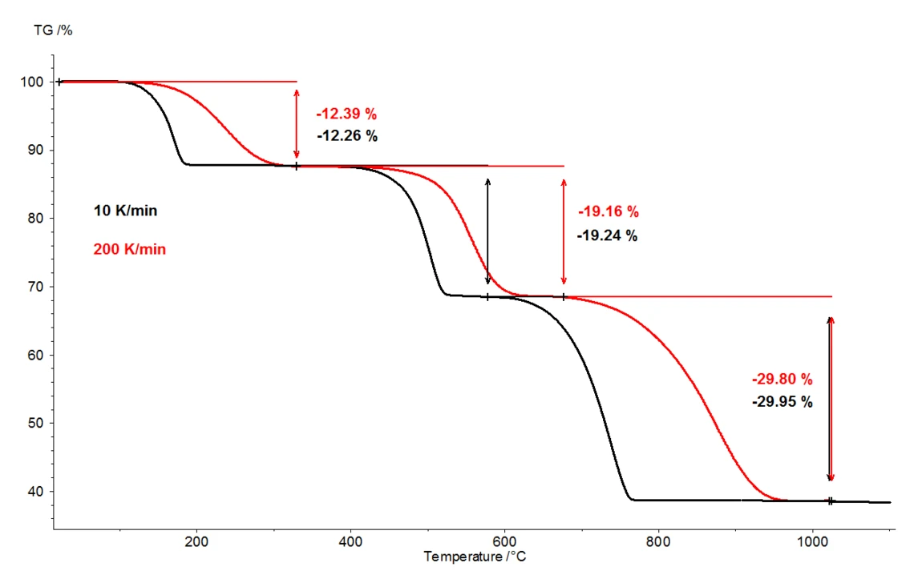
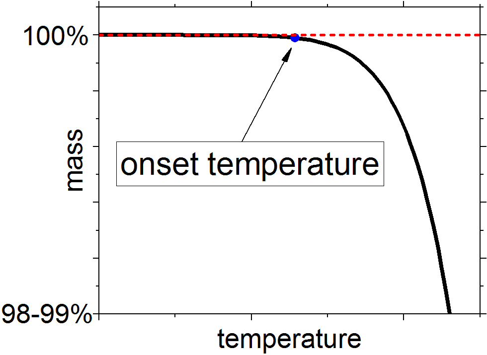
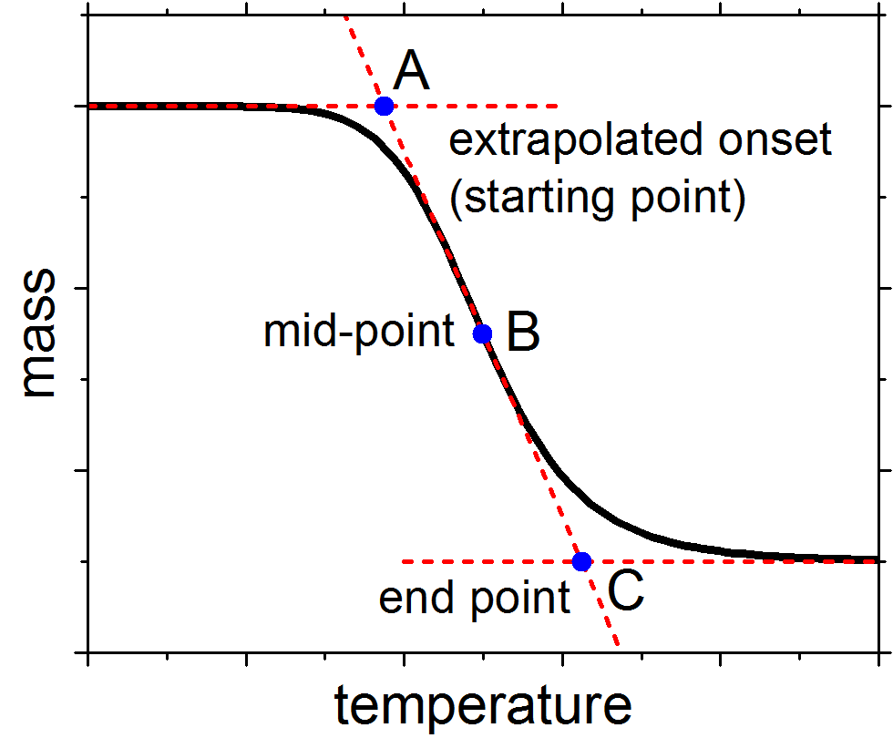
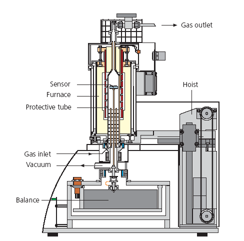

## Definitions

Thermogravimetry, which is often abbreviated as TG or TGA (from *thermogravimetric analysis*), is one of the thermal analysis techniques, defined by IUPAC as[^1]:

> A technique in which the mass of a substance (and/or its reaction product(s)) is measured as a function of temperature whilst the substance is subjected to a controlled temperature program.

Weighing something is a major method of quantifying its amount. Consequently, thermogravimetry is an extension of this method, allowing us to study how the amount of something changes with temperature or in time in different conditions. In addition to temperature ($T$), pressure ($p$) and the composition of the gas atmosphere are the main variable parameters in TGA.

## Basics

The basics of the method are fairly easy to understand, if not outright intuitive: we heat something up, its mass changes, the "balance" part of the "thermobalance" measures this change and records it along with the temperature as the useful signal. The interpretation of the nature of the mass changes often relies on the general knowledge and the magnitude of observed mass changes. Consider, for example, the following thermogravimetric curve for the decomposition of calcium oxalate monohydrate, $\ce{CaC2O4*H2O}$:

<figure markdown>
  { width="600" }
  <figcaption markdown>Thermogravimetric curves for $\ce{CaC2O4*H2O}$ (source - [Netzsch](https://analyzing-testing.netzsch.com/en/application-literature/tga-measurements-on-calcium-oxalate-monohydrate))</figcaption>
</figure>

Even without knowing the exact stages in the decomposition, it is reasonable to suppose that the first step would consist of the loss of the crystal hydrate water. Indeed, the mass change observed during the first decomposition step, ≈12.3%, closely corresponds to the water content in the crystal hydrate (12.33%). Likewise, the other stages can be identified based on the temperatures at which they occur and on the corresponding mass losses:

$$\ce{CaC2O4*H2O -> CaC2O4 + H2O}$$

$$\ce{CaC2O4 -> CaCO3 + CO}$$

$$\ce{CaCO3 -> CaO + CO2}$$

However, this was a rather simple example, and the chemistry of the processes may not always be obvious from the TGA data alone. By the mass conservation law, when the mass of the sample changes, the composition of the atmosphere should change as well. In some cases, if the nature of observed mass changes is unclear, thermogravimetry can be coupled with evolved gas analysis (EGA) techniques to find out, for example, what gaseous products are released from the sample. In EGA, the gas outlet of the thermobalance is connected to the equipment (e.g., the mass spectrometer) that allows determining the gas composition. 

Another popular option, unrelated to the gas analysis, is implemented in many commercial TGA setups. It consists in combining the TGA and the differential scanning calorimetry (DSC) methods. This allows simultaneous thermal analysis (STA), in which it is possible to determine both the mass changes and the accompanied heat effects at the same time. Thus, the additional knowledge of the energetics of the processes can provide insights into their nature.

Finally, other methods, such as X-ray diffraction or elemental analysis, can be used to identify the composition of the solid residue after the TGA experiments.

### Important points

In order to characterize the TGA curves, we need to select the relevant points corresponding to the observed mass changes. Simply speaking, we need to answer such questions as "Where do the processes start? Where do they end?"

Perhaps, the most simplistic and intuitive parameter that can be used to define the start of the process is a simple onset point:

> **onset point** (temperature or time), the temperature or time at which a deflection is first observed from the established baseline prior to the thermal event[^2]

Such definition of the onset point is rather vague, but for some processes it can yield a reasonably conservative estimate of the temperature below which the process is not realized with a perceptible rate. This may be useful for estimating thermal stability of materials, in which case the *point where the deflection from the baseline is first observed* is determined from the plots zoomed to within 1-2%, as shown in the figure below.[^3]

<figure markdown>
  {width="400"}
  <figcaption>Simple onset temperature determination: red dashed line - extrapolated baseline</figcaption>
</figure>

Another set of important points can be found by extrapolating the baselines. This way of determining the onset of the processes is more consistent and less dependent on the particular experimental parameters.[^4] Thus, it is used in many cases, and not only in TGA, but also in DSC, e.g., for finding out the melting points of substances in measurement and calibration experiments.[^5]

The definition of the extrapolated onset temperature may be a bit convoluted:

> **extrapolated onset point** (temperature or time), the temperature or time found by extrapolating the baseline prior to the thermal event to the intersection of a tangent constructed at the inflection point on the leading edge of the thermal event[^2]

However, in reality, this point is simple to find. Consider the example given in the figure below.

<figure markdown>
  {width="400"}
  <figcaption>Extrapolated onset temperature determination</figcaption>
</figure>

The horizontal dashed lines are the extrapolated baselines. The diagonal dashed line is the tangent line through the approximate "inflection point" (here it is a mid-point) of the step. To calculate precise extrapolated lines and tangents, curve fitting is required. However, in practice, this is almost never done, and the linear extrapolations and tangential line are drawn manually (the latter is traced through the linear section of the slope, which is often around the mid-point). It is easy to show that the errors introduced by such approximate extrapolations are negligible.

The points in the figure above are:

- **A**: the extrapolated onset temperature, which is the temperature of the intersection of the extrapolated *initial* baseline and the tangent line through the inflection point (or the linear mid-section) of the descending step slope;
- **B**: the mid-point, which acts here as the inflection point, where the speed of the mass loss is at its maximum;
- **C**: the extrapolated completion temperature, or the end point, defined similarly to **A** but with the extrapolated *final* baseline.

A few more examples, including the ones where there are several mass loss steps or where the baseline is not flat, can be found in ISO 11358, which also explains how to find the mass changes in some complex cases.[^6]

And a final remark: in some cases, the differential thermogravimetric (DTG) curve, calculated simply by differentiating the TGA curve, may help to identify the important points on the TGA curve.

### Buoyancy and corrections

For most precise thermogravimetric measurements, it is generally recommended to make "blank" experiments and perform corresponding corrections, which are often called "buoyancy corrections". The need for such corrections arises from the fact that, according to the Archimedes' principle, the upward buoyant force is exerted on all bodies immersed in a medium (either liquid or gas). As a result, the measured mass, $m_\mathrm{meas}$, differs from the mass of the sample in vacuum, $m$, by a factor proportional to the density of the medium, $\rho$, and the volume of the sample, $V$, which is the volume of the medium displaced by the sample:[^7]

$$m_\mathrm{meas} = m - \rho V. \label{truemass}$$

During the thermogravimetric experiments, the density of gas changes, giving rise to the apparent mass gain equal to $V \cdot \Delta \rho$. The density of gas is equal to

$$\rho = \frac{pM}{ZRT},$$

where the compressibility factor $Z = 1$ for ideal gas, and $R$, $T$, $p$, amd $M$ are the universal gas constant, the temperature, the pressure and the molar mass of the gas, respectively. It follows that buoyancy depends on:

- the nature of the sample: larger-volume samples are more buoyancy-sensitive;
- the nature of the gas: there's less buoyancy in light gases with low $M$ ($\ce{H2}$, $\ce{He}$);
- the total pressure: buoyancy is nonexistent in vacuum;
- the temperature: buoyancy is lower at high temperatures.

The situation may be further complicated by the heat transfer issues.[^8] At low temperatures, when the heat transfer from the furnace to the sample thermocouple is realized through convection, it takes some time to evenly heat up the thermocouple and the sample crucible. At the beginning of heating, warm air preferably flows along the inside of the protective tube around the sample, and thus does not reach the crucible with the sample immediately. Thus, the actual temperature of the gas is higher than the temperature sensor indicates in these conditions. This accounts for a sharp rise in the measured mass values at the beginning of the measurements. To make matters worse, the time required to achieve uniform heating of the sample chamber depends on the heating speed and the thermal conductivity of the sweep gas.

As a consequence, it is quite hard to calculate the buoyancy corrections accurately from purely theoretical considerations. Instead, it is preferred to run the blank measurements in exactly the same conditions as in the actual measurements, including the gas compositions, flow rates and pressures, and the temperature program. Such kind of correction may even compensate for the issues not caused by buoyancy, e.g., variations in the convective gas flows exerting different pressure on the measurement crucible, the parasitic radiative heating of the balance by the oven at high temperatures, or some other less evident phenomena. In addition, to make the buoyancy similar in the blank and measurement experiments, it is customary to perform the former not with the empty crucible, but with the crucible filled with inert substance such as $\ce{Al2O3}$. This is especially important for large sample masses. The amount of the inert substance should be taken for its volume to be close to the volume of the samples in the measurement experiments.

The corrected mass can be calculated by simply subtracting the results of the correction experiment from the results of the measurements:

$$\Delta m_\mathrm{true} = \Delta m_\mathrm{meas} - \Delta m_\mathrm{corr}.$$

### Calibration

As mass and temperature are the primary signals in TGA, both the mass scale and the temperature scale can be calibrated. The mass scale calibration[^9] process is similar to the calibration of simple analytical balances. In cases when the temperature calibration is required, it can be performed by either melting points of standard substances[^5] (in the STA setups) or magnetic transitions in standard substances[^10] (in the TGA setups with no simultaneous calorimetric capabilities).

## Oxygen nonstoichiometry

Because this course is heavily oxide-oriented, of all the things that can possibly be studied by TGA, let's consider the investigation of the oxygen content in nonstoichiometric oxides.[^11] For an abstract $\ce{MO_{1 - \delta}}$ oxide, oxygen exchange can be expressed as

$$\ce{MO_{1 - \delta} <->[{$T\ \mathrm{or}\ p_{\ce{O2}}$ \mathrm{change}}] MO_{1 - \delta - \Delta \delta} + \frac{\Delta \delta}{2}O2} \label{oxygenloss}$$

Such loss of the lattice oxygen may correspond to a process written in Kröger-Vink notation as

$$\ce{O^{\times}_O <=> \frac{1}{2}O_2 + V^{\bullet \bullet}_O + 2e^{'}}$$

in case of the delocalized electron charge carriers and with a stoichiometric $\ce{MO}$ used as a reference crystal.[^12]

The amount of oxygen lost either upon heating or following the change in the gas composition can be calculated, based on Equation $\ref{oxygenloss}$, as

$$\Delta \delta = \frac{2n_\ce{O2}}{n_\ce{MO_{1 - \delta}}} = \frac{m_\ce{O2}}{M_\ce{O}} \cdot \frac{M_\ce{MO_{1 - \delta}}}{m_\ce{MO_{1 - \delta}}} = \frac{\Delta m}{M_\ce{O}} \cdot \frac{M_\ce{MO_{1 - \delta}}}{m_\ce{MO_{1 - \delta}}},$$

where $n_i$, $m_i$ and $M_i$ are the amount, mass and molar mass of the substance $i$, and $\Delta m = m_\ce{O2}$ is the mass loss measured with TGA (on condition, of course, that all detected mass change is only due to the oxygen exchange, as per Equation $\ref{oxygenloss}$).

However, in this way, it is only possible to measure the change in the oxygen nonstoichiometry $\Delta \delta$ depending on the variable conditions of the experiment (most often, on $T$). To calculate how the absolute oxygen nonstoichiometry $\delta$ changes in these conditions, we need to know what $\delta$ is in some conditions (e.g., at room temperature) so as to use this value as a reference point. To give a particular example, if we knew that after heating in air from room temperature up to $T$ the nonstoichiometry in $\ce{MO_{1 - \delta}}$ changes by 0.01 ($\Delta \delta = 0.01$), and if we knew that the absolute nonstoichiometry at room temperature is 0.1 ($\delta_\mathrm{air,\ 298\ K} = 0.1$), then we could say that at $T$ the oxygen content in our oxide is $1 - \delta - \Delta \delta = 0.89$.

One way of measuring the absolute nonstoichiometry is by reducing the oxide at high temperatures in a thermobalance in hydrogen-containing mixtures. The reduction products should be metals, or stoichiometric oxides that are not reduced in hydrogen, or their mixtures. In any case, the composition of the products should be known (and, preferably, confirmed with X-ray diffraction). For our abstract oxide, the complete reduction reaction may look as

$$\ce{MO_{1 - \delta} + (1 - \delta)H2 ->[\mathrm{high}\ $T$] M + (1 - \delta)H2O}. \label{redm}$$

Using the obvious relationship,

$$n_\ce{M} = n_\ce{MO_{1 - \delta}},$$

rewritten as

$$\frac{m_\ce{M}}{M_\ce{M}} = \frac{m_\ce{MO_{1 - \delta}}}{M_\ce{MO} - \delta M_\ce{O}},$$

we obtain

$$\delta = \frac{M_\ce{MO}}{M_\ce{O}} - \frac{m_\ce{MO_{1 - \delta}}}{m_\ce{M}} \cdot \frac{M_\ce{M}}{M_\ce{O}}, \label{nonst}$$

where $m$ and $M$ are the mass and the molar mass, $\ce{MO}$ is the stoichiometric oxide, $\ce{M}$ is the general formula of the solid reduction products, and $\ce{O}$ is the atomic oxygen. Accordingly, $m_\ce{MO_{1 - \delta}}$ and $m_\ce{M}$ correspond to the mass of the oxide before the reduction and the mass of the solid reduction products.

While Equations $\ref{redm}$-$\ref{nonst}$ are written here for an imaginary binary oxide $\ce{MO_{1 - \delta}}$, they apply equally well to any reducible complex oxide. One should only keep in mind that not every oxide can be reduced in hydrogen to the corresponding metal and understand how to write the formula for the reduction products. Consider now, for example, the following complete reduction reaction:

$$\ce{LaCoO_{3 - \delta} + (1.5 - \delta)H2 -> 0.5La2O3 + Co + (1.5 - \delta)H2O}. \label{redlacoo3}$$

Equation $\ref{nonst}$ can be applied to process $\ref{redlacoo3}$ by replacing the nonstoichiometric oxide, $\ce{MO_{1 - \delta}}$, stoichiometric oxide, $\ce{MO}$, and reduced oxide, $\ce{M}$, with $\ce{LaCoO_{3 - \delta}}$, $\ce{LaCoO3}$ and $\ce{LaCoO_{1.5}}$,[^13] respectively.

## Equipment

There are many scientific equipment manufacturers with thermobalances among their products, from the widely known, such as [Netzsch](https://analyzing-testing.netzsch.com/en/products/thermogravimetric-analysis-tga-thermogravimetry-tg), [Setaram](https://setaramsolutions.com/standard-solutions), [Linseis](https://www.linseis.com/en/products/thermogravimetric-analyzer-tga/), and
[TA Instruments](https://www.tainstruments.com/products/thermal-analysis/thermogravimetric-analysis/)
to the less well-known such as [CI Precision](https://www.ciprecision.com/products/recording-microbalances/). Accordingly, there are several different designs, from the Setaram's hang-down
symmetrical beam balance to the TA's (Rubotherm) magnetic suspension balance.

In this lab, we use one of the relatively basic (and, for that reason, one of the sturdiest) TGA setups, Netzsch STA 409 PC. The schematic of the setup is given in the figure below. The main parts are, of course, the furnace and the balance, which in this setup is placed underneath the furnace. The furnace can be raised, providing the access to the sample holders (see *sensor* in the figure below). There are two interchangeable sample holders for Netzsch STA 409: for the DSC and for the thermogravimetry. In this lab, we're using the latter, which is basically a thermocouple onto which the thermogravimetric crucible is placed.

<figure markdown>
  
  <figcaption>Netzsch STA 409 PC schematic</figcaption>
</figure>

The constant temperature of the balance is maintained with a curculating water bath thermostat (not shown). The protective dense alumina tube along with the gas sweep system allow controlling and maintaining the required gas atmosphere inside the thermobalance.

## Measurements

1. First, the measurement crucible should be cleaned after the previous experiments. Cleaning the crucible involves the following steps:
    1. Dissolving the solid residues in acid ($\ce{HCl}$ or, even better, $\ce{HNO3}$) upon heating on a hot plate.
    2. Boiling the crucible in distilled water on a hot plate.
    3. Drying the thermogravimetric crucible (completely) in a big clean alumina crucible on a hot plate.
    4. Annealing the thermogravimetric crucible in an oven at 1100 °C for at least a few dozen minutes.
    5. Cooling the crucible down to room temperature.

    The thermogravimetric crucible should be handled only in gloves (especially after annealing) to prevent its contamination by grease from the hands.

2. Weigh the crucible on analytical balances and record its mass.
3. Put the sample powder (e.g., ≈1 g) into the crucible. Do not spill the sample onto the rim and the sides of the crucible.
4. Weigh the crucible with the sample inside on analytical balances and record the mass.
5. Open the thermobalance (raise the oven), place the crucible onto the sample holder (thermocouple) in the thermobalance and close the oven.
6. Now you should set the experiment parameters, including the name of the sample, the initial masses, the temperature program, the sweep gases, and so on. All of it is done in the software.
7. When inert ($\ce{N2, Ar, He}$) or reactive ($\ce{H2, O2}$) sweep gases are used in the measurements, care should be taken to ensure that all air inside the TGA setup is displaced with required gas or gas mixture. For this purpose, if vacuum is not used to replace the gas inside the thermobalance, prolonged washing of the setup with the target gas mixtures is needed *before* the beginning of the measurements.

## Praise

The practical importance of thermoanalytical techniques is hard to overestimate. A complete list of [ASTM's thermal analysis standards](https://www.astm.org/products-services/standards-and-publications/standards/thermal-analysis-standards.html) features more than 70 documents, and that's only the *standards* from just one organization! There are many more non-standard things that can be performed with thermoanalysis in R&D.

[^1]: IUPAC Gold Book: [thermogravimetry](https://doi.org/10.1351/goldbook.T06324) and [thermal analysis](https://doi.org/10.1351/goldbook.T06295) definitions.
[^2]: ASTM E 473 "Standard Terminology Relating to Thermal Analysis", [https://doi.org/10.1520/E0473-23B](https://doi.org/10.1520/E0473-23B)
[^3]: ASTM E 2550 "Standard Test Method for Thermal Stability by Thermogravimetry", [https://doi.org/10.1520/E2550-21](https://doi.org/10.1520/E2550-21)
[^4]: G.W.H. Höhne, W. Hemminger, H.-J. Flammersheim. Differential Scanning Calorimetry: An Introduction for Practitioners. Springer-Verlag Berlin Heidelberg, 1996, eISBN 978-3-662-03302-9, [https://doi.org/10.1007/978-3-662-03302-9](https://doi.org/10.1007/978-3-662-03302-9)
[^5]: ASTM E 967 "Standard Test Method for Temperature Calibration of Differential Scanning Calorimeters and Differential Thermal Analyzers", [https://doi.org/10.1520/E0967-18](https://doi.org/10.1520/E0967-18)
[^6]: ISO 11358-1 "Plastics. Thermogravimetry (TG) of polymers. Part 1: General principles", [https://www.iso.org/standard/79999.html](https://www.iso.org/standard/79999.html); the Russian version of this standard is ГОСТ Р 56721
[^7]: 
  Because of the way in which the balances are calibrated, Equation $\ref{truemass}$ cannot be used to calculate the true weight in vacuum based on the balance reading. This is how it can be, and is, calculated in the most precise measurements with microbalances (e.g., for combustion calorimetry): $m_\mathrm{in\ vacuo} = m_\mathrm{meas} \cdot \left(1 - \frac{\rho(\mathrm{air})}{\rho(\mathrm{cal\ weight})}\right) / \left(1 - \frac{\rho(\mathrm{air})}{\rho(\mathrm{sample})}\right)$, where $\rho(\mathrm{air})$ is the density of air, which is usually around $1.2\ \pu{kg/m^3}$ but depends strongly on the temperature, pressure and humidity, $\rho(\mathrm{cal\ weight})$ is the density of the calibration weight, which is typically $8\ \pu{g/cm^3}$, and $\rho(\mathrm{sample})$ is the density of the weighing sample.
[^8]: This paragraph was inspired by the Netzsch STA 409 instruction manual and may not be relevant to the setups in which the temperature sensor is not located near the sample crucible inside the protective tube where the gas flows (e.g., to Setaram Sensys TG/DSC, to name just one).
[^9]: ASTM E 2040 "Standard Test Method for Mass Scale Calibration of Thermogravimetric Analyzers", [https://doi.org/10.1520/E2040-19](https://doi.org/10.1520/E2040-19)
[^10]: ASTM E 1582 "Standard Practice for Calibration of Temperature Scale for Thermogravimetry", [https://doi.org/10.1520/E1582-21](https://doi.org/10.1520/E1582-21)
[^11]: For somewhat more detailed and broad account, see: Zuev A.Y., Tsvetkov D.S. (2017). Conventional Methods for Measurements of Chemo-Mechanical Coupling. In: Bishop, S., Perry, N., Marrocchelli, D., Sheldon, B. (eds) Electro-Chemo-Mechanics of Solids. Electronic Materials: Science & Technology. Springer, Cham. [https://doi.org/10.1007/978-3-319-51407-9_2](https://doi.org/10.1007/978-3-319-51407-9_2)
[^12]: ...and the loss of the interstitial oxygen would be expressed as $\ce{O^{''}_i <=> \frac{1}{2}O_2 + V^{\times}_i + 2e^{'}}$. However, the defect chemistry differs a lot between oxides. You may encounter many quite different reactions that describe the oxygen exchange processes in different defect structure models.
[^13]: The molar mass of $\ce{LaCoO_{1.5}}$, which is the general formula of reduced $\ce{LaCoO_{3 - \delta}}$, is obviously equal to the total molar mass of the solid reduction products in Equation $\ref{redlacoo3}$: $M_\ce{LaCoO_{1.5}} = 0.5M_\ce{La2O3} + M_\ce{Co}$