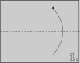
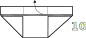
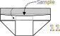
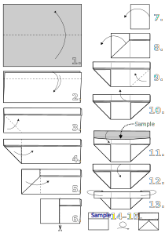

In this tutorial[^1] we're making square-ish paper packets (or envelopes). Packets such as these are very convenient for storing and transporting small batches of powdered or even sintered ceramic samples.

1. Start with a random sheet of paper. For powders, thin smooth tracer paper is preferred. Fold the sheet in half along the dashed line (the bottom half goes to the top).
    <figure markdown>{ width="300" }</figure>
2. Make a small fold at the top. The height of this fold will determine the height of the top fold in the finished packet and the size of the flaps that are used to seal the packet. About 1 cm should be enough for small packets.
    <figure markdown>{ width="300" }</figure>
3. Make a diagonal fold starting from the bottom left corner up to the top flaps.
    <figure markdown>{ width="300" }</figure>
4. Make a widthwise fold as shown, using imaginary vertical line formed by the diagonal fold that you've just made as a guide.
    <figure markdown>{ width="300" }</figure>
5. Continue folding everything widthwise.
    <figure markdown>{ width="300" }</figure>
6. Cut or tear off the rightmost part of the paper. We won't need it anymore.
    <figure markdown>{ width="220" }</figure>
7. Unfold the flap to the left.
    <figure markdown>{ width="190" }</figure>
8. Unfold the flap to the left once more.
    <figure markdown>{ width="300" }</figure>
9. Make a diagonal fold starting from the bottom right corner up to the top flaps. This step should create a right flap which would be symmetrical to the one on the left.
    <figure markdown>{ width="300" }</figure>
10. Open the packet by unfolding the flap at the top (only one of them! the one that forms the outer layer).
    <figure markdown>{ width="300" }</figure>
11. Put something inside the packet using the opening at the top, and then fold the top flap back, returning our origami packet to the state it was in before the previous step.
    <figure markdown>{ width="300" }</figure>
12. Make a fold from the top down along the line between the diagonal flaps and the top flaps.
    <figure markdown>{ width="300" }</figure>
13. Fold the left and right flaps backwards, and push one flap underneath and "inside" the other. This may be the tricky part. If you're having trouble with this, look closely at the side flap. There's a space (a gap) between the top folds and the diagonal folds. Into this gap in one of the side flaps, you need to push the topmost part of the other one.
    <figure markdown>{ width="300" }</figure>
14. This is the front side of the packet. It's most convenient to sign it on the top flap where the paper is thicker. Turn the packet over. The place where the side flaps meet, sealing the packet, is the back side.
    <figure markdown>{ width="300" }</figure>

There's also a memo with all the steps that you can print out on a regular A4 paper:
<figure markdown>{ width="500" }</figure>

For those of you who like calculations, let's estimate the size of the piece of paper that we'll need to make a square packet by following the instructions above:

$$\mathrm{heigth} = 2a + 4h_{\mathrm{top}}, \notag{}$$

$$\mathrm{width} = 3a, \notag{}$$

where $a$ is either the total height or the total width of the finished square packet, and $h_{\mathrm{top}}$ is the height of the top fold where we usually write the sample name, formula or ID.

<figure markdown>{ width="200" }</figure>

The equations above are approximate: they do not take into account the amount of paper that goes into creases and folds.

And, once you grasp the basics of how the square packets are made, it should be easy for you to modify the original procedure so as to make, for example, wide rectangular ones.

[^1]: Please don't judge the images too harshly: it's the first time I'm making an origami diagram, and maybe the second time in my life I'm using [Inkscape](https://inkscape.org/)